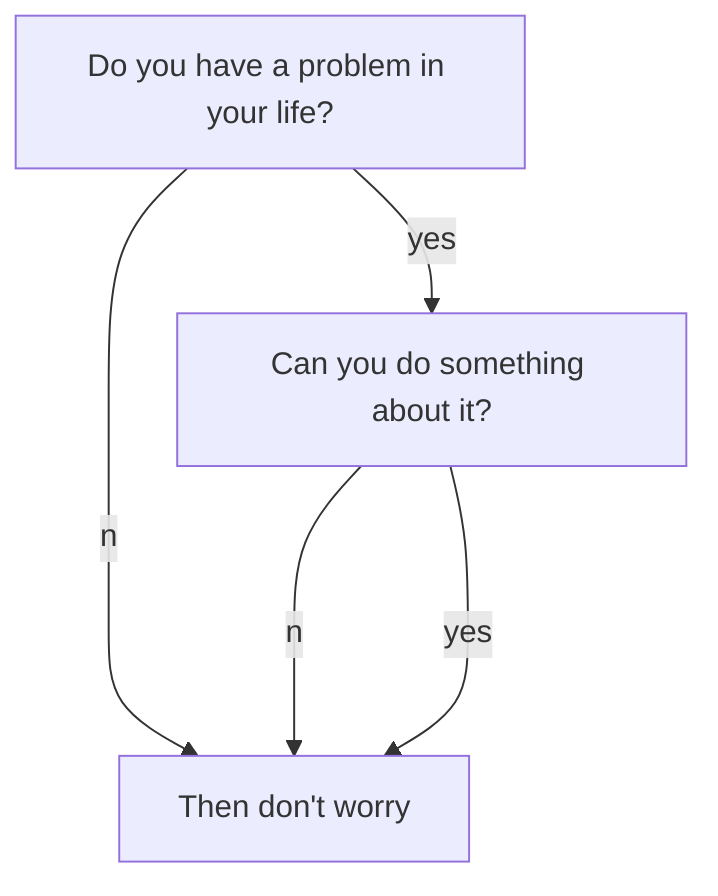
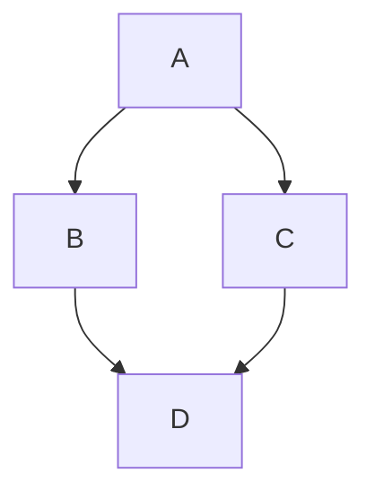
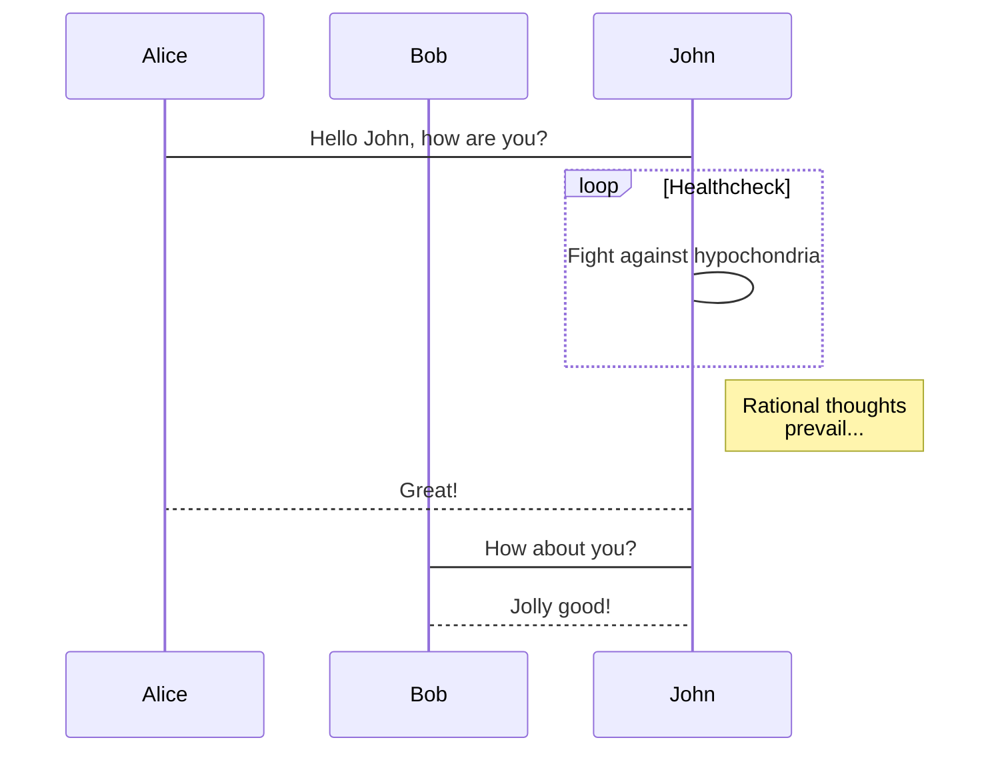
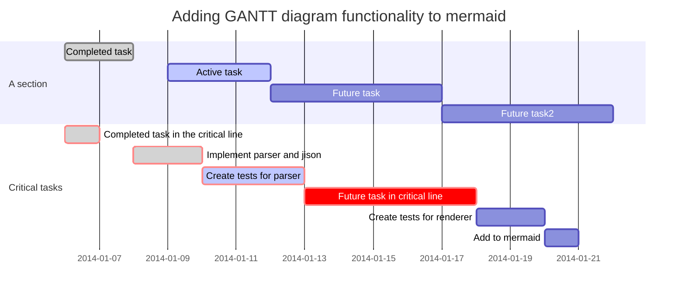

<!--more-->

Set `mermaid: true` in `_config.yml` or in the post's front matter to enable Mermaid.
{:.warning}

[TeXt Theme documentation: Mermaid](https://tianqi.name/jekyll-TeXt-theme/docs/en/markdown-enhancements#mermaid)

Mermaid generates diagrams and flowcharts from a text syntax similar to Markdown.

When a document needs to explain a process, sequence, or project schedule, Mermaid is lighter than tools such as Visio and easier to maintain alongside the text.

## Flowchart



**Markdown:**

````markdown

````

## Sequence Diagram



**Markdown:**

````markdown

````

## Gantt Diagrams



**Markdown:**

````markdown

````
