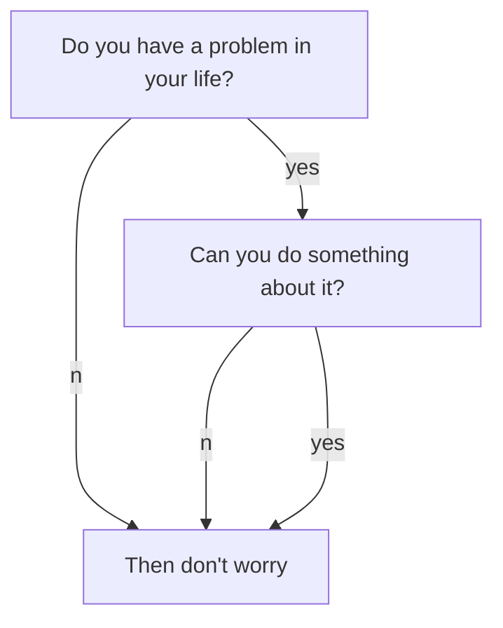
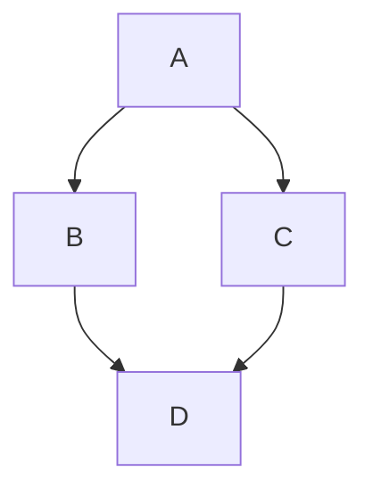
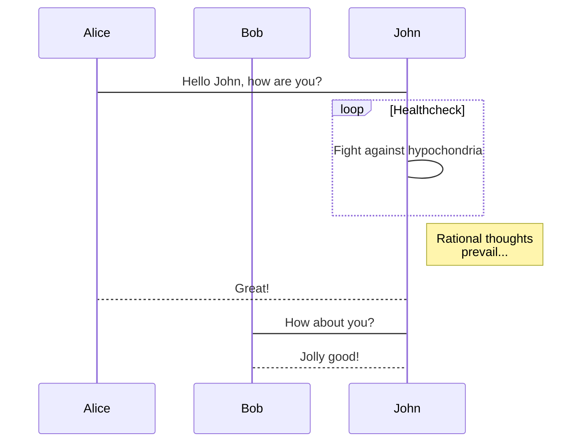
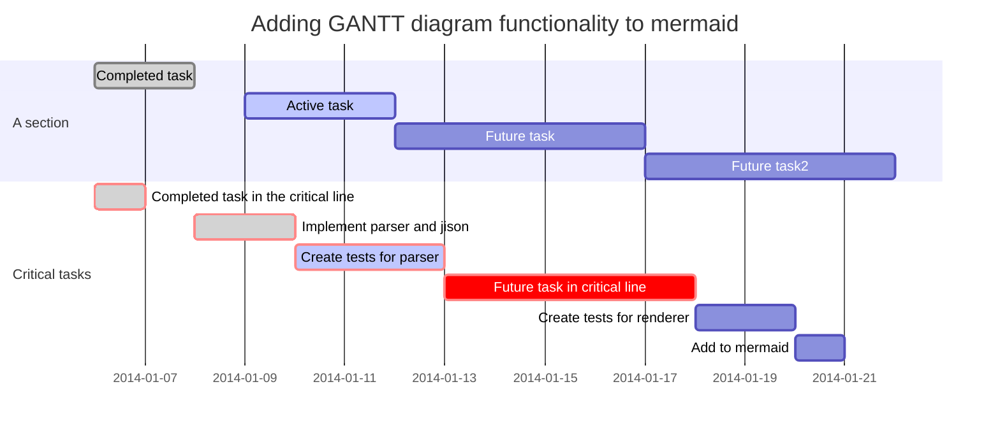

<!--more-->

需要在 `_config.yml` 或文章 front matter 中设置 `mermaid: true` 才能启用 Mermaid。
{:.warning}

[TeXt 主题文档：Mermaid](https://tianqi.name/jekyll-TeXt-theme/docs/en/markdown-enhancements#mermaid)

Mermaid 可以用接近 Markdown 的文本语法生成图表和流程图。

当需要在文档中说明流程、时序或任务计划时，它比使用 Visio 等重量级工具更轻便，也更容易随正文维护。

## Flowchart



**markdown:**

````markdown

```

## Sequence Diagram



**markdown:**

````markdown

```

## Gantt Diagrams



**markdown:**

````markdown

```
