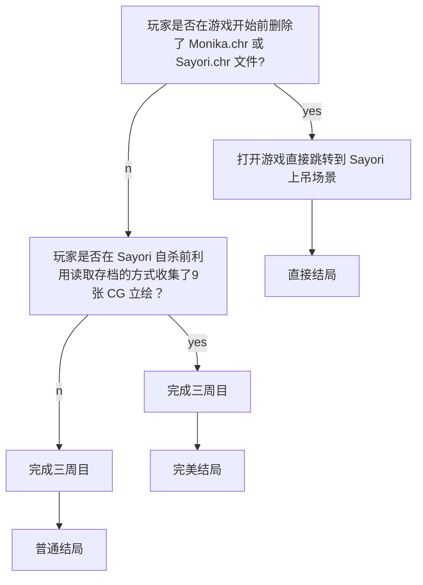

---

作为一名贫穷的高中生，本人所能涉及过的游戏是十分有限的。虽说如此，但我仍想介绍一下那些对我来说振奋人心的游戏。
游戏介绍顺序不分先后，因此这篇文章将以一个非专业解说的视角来领会一下 Team Salvato 的 Doki Doki Lierature Club。
<!--more-->

## 前言

首先，如果有谁看到了这篇文章，我不向各位推荐这个游戏，不开玩笑，这确实是个恐怖的 Metagame，它可能对一些承受能力较差的人产生不好的影响。
其次，我不觉得这是个很好的游戏，它针对的是特定的群体且剧情并没有那么出类拔萃，而且有许多负能量的东西。
而且我觉得这个游戏十分新颖、有意思。

## 为什么谈论这个游戏？

DDLC(Doki Doki Literature Club)这款游戏早在2017年刚发行时我就体验过，虽然在当时我并没有完全通关，但我对于游戏本身有了一定的了解。
最近由于Steam UI的更新把我之前很多放着吃灰的小游戏都直接显示在了库内，我又重新找到了这个特别的游戏并重新玩了一遍。
并且这游戏大概是我第一次接触到那么让我震撼的 Metagame（虽然我没玩过 Infinity 三部曲之类的，这也可能是我经历太少的原因吧），另一个则是 Undertale。

## 介绍

**<span style="color:red;">注意：本篇文章含有剧透内容！</span>**
**<span style="color:red;"><br/> 建议先游玩游戏后再看此文章！</span>**
{:.warning}

DDLC 在 Steam 上的宣传有面带着和善笑容的四个可爱女孩子，粉色的主题，优雅的音乐，再加上一个普通的 Gal 游戏介绍，一看就必定跟恋爱之类的扯上关系。
可 Steam 上的 `Psychological Horror`{:.info} 标签出卖了它，但你能想象这是个恐怖游戏吗？

相比于《灯穗奇谈》、《梦幻廻廊》亦或是《尸体派对》之类的恐怖 Gal，这个游戏没有像他们那样给玩家带来极度黑暗的心理扭曲，而它却给了我一种莫名的难受。
其实早些时候听说过那些忽悠人的游戏推荐，我当初并没有详细游戏，只是单纯被封面和免费二字所吸引。

一上来与其他的文字冒险游戏没什么两样，男主与邻居 Sayori 一同上学。在文学部的其他3位成员（分别是部长 Monika、副部长 Sayori 和其它两位成员 Yuri 与 Natsuki）的煽动下男主被迫入部。
在部长 Monika 的要求下各个成员每天都需要与其它人交换各自的诗。但随着你与部员的感情的升华，事情也渐渐变得奇怪……

## 录像

关于本游戏的视频（需要科学上网）

A Comprehensive Exploration of Doki Doki Literature Club
<br/> By [Nexpo](https://www.youtube.com/channel/UCpFFItkfZz1qz5PpHpqzYBw)
<div> </div>

## 深度解析

一些我收集到关于此游戏的深层内容及隐藏文件等（部分来源已注明）。

### 结局

我目前玩到的结局一共分为三个，我分别称它们为普通结局、完美结局及直接结局。

#### 达成条件



### 诗

游戏中男主通过在文学俱乐部互换各自的诗来增进与其它4位社员的感情，因此诗在全游戏中的比重非常大，可以说是游戏的精华部分之一。
<br/> 在游戏中我们是通过选择词语写诗来增进与其它社员的感情，而不是给自己看的。
每当你选择词语的时候，喜欢这个词语类型的人就会蹦起来，这是也游戏中唯一的攻略的方式。
通过查看每个成员的诗可以发现每个人的诗都与他们的性格相对，特别在游戏后期表达的尤其强烈。

{:.shadow}

<br/> 还挺可爱的，啊哈哈。
<br/> 但奇怪的是左下角只有三个人，每次写诗时都会少 Monika。问我为什么，我只能回答：这是设定的一部分。

<br/> 个人对游戏中诗歌的分析。

人物 | 内容（点击图片放大） | 分析
---|---|---
Sayori | {:.shadow} | 这首抒情诗是 Sayori 在早晨上学前写的，从最后一句话就可以看到，男主也开玩笑般的如此说到。因 Sayori 有早晨睡过头的毛病，男主经常帮助叫醒 Sayori，所以全诗像是表达了对男主的感激。<br/><br/>我们可以以后续男主安慰 Sayori 剧情的发展来重新审视这首诗。{:.shadow} 不难发现 Sayori 的这首诗真正表达的是她被抑郁症困扰以至于她无法面对每一天，这也正是她经常睡过头的原因；而“我将长眠”则意指结束自己的生命。
Monika | {:.shadow} | Save Me; Load me; Delete Her; 这是关于处理游戏目录下 Charater 文件夹的提醒讯息。在 *Monika 的今日写作小窍门*中她也告诉我们如何保存游戏之类的怪话。这些奇怪的暗示都表明了她与其它人物的与众不同从从而带动故事情节的发展。
Yuri | {:.shadow} | 这首诗的表意不明

### 只要 Monika！

玩过的人都知道 Monika 官方设定游戏中唯一一个有独立意识的角色。*（然而可悲的是即使她再多接近现实，她仍然是一个被设定好的一堆参数罢了）*

毫无疑问，Monika 就是这个游戏的核心人物。

在 "Just Monika" 的空间中，Monika 会不断与玩家进行交流。这是制作者精心制作对的近两个小时的不重复对话。

她告诉了我们关于面对生活的一些建议。

{:.shadow}

{:.shadow}

{:.shadow}

{:.shadow}

她还有「自己」的 Twitter。

{:.shadow}

面对面看着 Monika 与你交流，有种「近在咫尺却无法触及」的感觉,不是吗？
<br/> 甚至她能与你进行一些互动。

如果检测到你在运行游戏时有直播软件，她会给你做鬼脸。

{:.shadow}

{:.shadow}

你退出游戏重进后……

{:.shadow}

{:.shadow}

用你的计算机名用户名来称呼你。

{:.shadow}

说实话，这让我不禁想到人工智能。
<br/> 若能面对的是一个自主学习的 AI 而不是被指定的程序，游戏界必定会上升到一个新高度，想必这就是制作者所想实现却无能为力的吧。

## Your Reality

**游戏主题曲** 	

这是在游戏最后删除 `Monika.chr` 文件后的播放的一段音乐。

顺便一提，在完美结局中最后播放的视频不会删除角色立绘，并且在最后会得到 Team Salvato 写给玩家的信。

<div></div>

```
Every day, I imagine a future where I can be with you
每一天 我都想象着能和你在一起的未来
 

In my hand is a pen that will write a poem of me and you
笔在手，只谱写我与你的诗篇
 

The ink flows down into a dark puddle
墨泗流 汇作漆黑的深潭
 

Just move your hand - write the way into his heart!
尽挥洒 直到刻进他的心中！
 

But in this world of infinite choices
怎奈何 在这无限选择的世界上
 

What will it take just to find that special day?
应怎样 才能寻到那特殊的一天？
 

What will it take just to find that special day?
应怎样 才能寻到那特殊的一天？
 

Have I found everybody a fun assignment to do today?
今天我交给大家的课外作业有趣么？
 

When you're here, everything that we do is fun for them anyway
你在时，我们做的一切对她们而言都是那么的有趣
 

When I can't even read my own feelings
当我连自己的心都看不透时
 

What good are words when a smile says it all?
微笑足矣 又何必言语？
 

And if this world won't write me an ending
倘若这世界不能为我谱写结局
 

What will it take just for me to have it all?
该怎样，我才能拥有这一切呢？
 

Does my pen only write bitter words for those who are dear to me?
我的笔是否只能为所爱之人写下刻薄之语？
 

Is it love if I take you, or is it love if I set you free?
爱是该将你占有，还是让你自由？
 

The ink flows down into a dark puddle
墨滴落 如同黑色的泪水
 

How can I write love into reality?
应如何？才能将真实的爱诉说
 

If I can't hear the sound of your heartbeat
是不是因为我听不到你的心跳声
 

What do you call love in your reality?
你的世界究竟称何为爱？
 

And in your reality, if I don't know how to love you
如果在你的世界，我不懂如何爱你
 

I'll leave you be
我将离你而去
```

### JUST MONIKA

JUST MONIKA

## 参考

1.