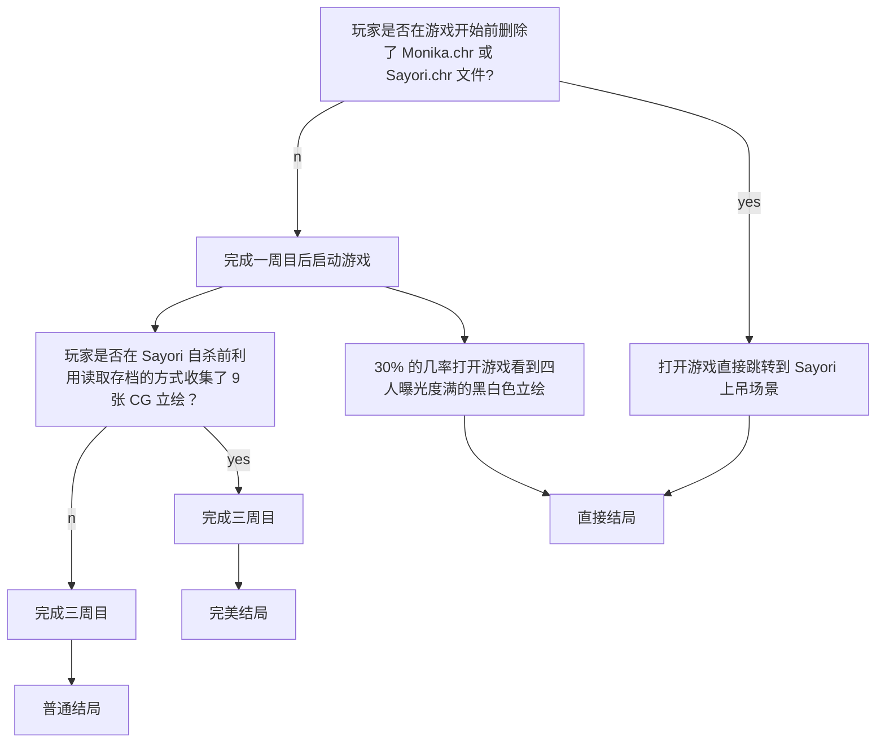

作为一名贫穷的高中生，本人所能涉及过的游戏还是十分有限的。即使这样，我仍想介绍一下那些对我来说振奋人心的游戏。
游戏介绍顺序不分先后，因此这篇文章将以一个非专业解说的视角来领会一下 Team Salvato 的 Doki Doki Lierature Club。
<!--more-->
{:.info}

---

## 前言

首先，如果有谁看到了这篇文章，我不向各位推荐这个游戏，不开玩笑，这确实是个恐怖游戏，它可能对一些承受能力较差的人产生不好的影响。
其次，我不觉得这是个很好的游戏，它针对的是特定的群体且剧情并没有那么出类拔萃，而且有许多负能量的东西。
但我觉得这个游戏十分新颖、有意思。因此我会以自己的观点去看待某些内容，如果你有歧义，可以评论下一起讨论。

## 为什么谈论这个游戏

DDLC(Doki Doki Literature Club) ——世界一流的视觉小说。这款游戏早在2017年刚发行时我就体验过，尽管在当时我并没有完全通关，但我对于游戏本身有了一定的了解。最近由于 Steam UI 的更新把我之前很多放着吃灰的小游戏都直接显示在了库内，我又再次找到了这个特别的游戏并重新玩了一遍。我发现它这玩意是真的「振奋人心」，不说了，我先去吃粒速效救心丸……

这大概是我第一次接触到那么让我震撼的 Metagame（原谅本人浅见寡识，没玩过 Infinity 三部曲之类的经典），另一个则是 Undertale。

## 介绍

** 注意：本篇文章含有大量剧透内容！ **
**  建议先游玩游戏后再看此文章！ **
{:.warning}

DDLC 在 Steam 上的宣传有面带着和善笑容的四个可爱女孩子，粉色的主题，优雅的音乐，再加上一个普通的 Gal 游戏介绍，一看就必定跟恋爱之类的扯上关系。
可 Steam 上的 `Psychological Horror` 标签出卖了它，但你能想象这是个恐怖游戏吗？相比于「灯穗奇谈」、「梦幻廻廊」抑或是「尸体派对」之类的恐怖 Gal，这个游戏没有像他们那样给玩家带来极度黑暗的心理扭曲，而它却给了我一种莫名的难受。

其实早些时候听说过那些忽悠人的游戏推荐，我当初并没有详细了解游戏，只是单纯被封面和免费二字所吸引。直到看到「晴天娃娃」才知道它的威慑力。 

一上来与其他的文字冒险游戏没什么两样，男主与邻居 Sayori 一同上学。在文学部的其他 4 位成员（分别是部长 Monika、副部长 Sayori 和其它两位成员 Yuri 与 Natsuki）的煽动下男主被迫入部。在部长 Monika 的要求下各个成员每天都需要与其它人交换各自的诗。但随着你与部员的感情的升华，事情也渐渐变得奇怪……

## 录像

关于本游戏的视频，需要科学上网（这游戏能在国内放送？别想了）。

<a class="button button--outline-info button--pill" href="https://www.youtube.com/watch?v=kB1663FTpzU" target="_blank" title="唬人的预告片">
<i class="fab fa-youtube"></i> Doki Doki Literature Club! Trailer</a>
<a class="button button--outline-success button--pill" href="https://www.youtube.com/channel/UC41-En1dwTQ6SRtDH0oY8bw" target="_blank" title="Author">
<i class="fas fa-user"></i> Team Salvato</a>

 

<a class="button button--outline-info button--pill" href="https://www.youtube.com/watch?v=mGZC61dBIWg" target="_blank" title="把恐怖游戏玩成搞笑游戏的家伙">
<i class="fab fa-youtube"></i> RESPECT WHAMEN: THE GAME. Doki Doki Literature Club</a>
<a class="button button--outline-success button--pill" href="https://www.youtube.com/user/PewDiePie" target="_blank" title="Author">
<i class="fas fa-user"></i> Pewdiepie</a>

 

<a class="button button--outline-info button--pill" href="https://www.youtube.com/watch?v=pnCp-PikHqE" target="_blank" title="游戏深度揭秘">
<i class="fab fa-youtube"></i> A Comprehensive Exploration of Doki Doki Literature Club</a>
<a class="button button--outline-success button--pill" href="https://www.youtube.com/channel/UCpFFItkfZz1qz5PpHpqzYBw" target="_blank" title="Author">
<i class="fas fa-user"></i> Nexpo</a>

 

## 深度探索

很多人认为这是一款 Galgame，但我觉得如果用视觉小说 (Visual Novel) 来称呼它的话会更贴切。虽说官方在预告片中忽悠的有模有样，但我觉得游戏更主要的是在于探索。玩这个游戏就像在阅读一个恐怖惊悚的视觉小说，也有人称它为「大型预告片」。因为这个被彩蛋及暗示包裹着的游戏就像是个披着羊皮的狼。但这也是它的魅力之一，神秘的剧情和深奥的解密总会让些「探索者」们心动……

下面是一些我收集到关于此游戏的深层内容及隐藏文件等（部分来源已注明）。

### 结局

我目前玩到的结局一共分为三个，我分别称它们为普通结局、完美结局及直接结局。

达成条件如下：

### 文字与诗

Sayori 上吊之后进入二周目。社员们行为举止变得异常，特别是 Yuri 和 Natsuki。每当社员们说出一些极端的话语时，她们的文字会变成粗体字，游戏画面或人物不时出现瞬间崩坏的现象。部分胡言乱语的现象也会被改成乱码。

#### 浏览图片

含有恐怖谷效应！

	

		

		

		

		

		

		

		

		

		

		

		

		

		

		

	

	

	

#### 诗

游戏中主角通过在文学俱乐部互换各自的诗来增进与其它 4 位社员的感情，因此诗在全游戏中的比重非常大，可以说是游戏的精华部分之一。这也是为什么它被称作为诗歌模拟器的原因。

在游戏中我们是通过选择词语写诗来增进与其它社员的感情，而不是给自己看的。每当你选择词语的时候，喜欢这个词语类型的人就会蹦起来，这是也游戏中唯一的攻略的方式。通过查看每个成员的诗可以发现每个人的诗都与他们的性格相对，特别在游戏后期表达的尤其强烈。

{:.shadow}

还是有够可爱的......

奇怪的是左下角只有三个人，每次写诗时都会少 Monika。问我为什么，只能回答：这是设定的一部分。

接下来是我个人对游戏中诗的分析（点击图片浏览大图）。

更详细的分析务必参考：[Understanding All of DDLC's Poems](https://tay.kinja.com/spoiler-understanding-all-of-ddlc-s-poems-1823087306){:target="_blank"}

---

	

		
	

	

		

			<h4> Sayori 1 ARC 1 </h4>
		

		

			

				这首抒情诗是 Sayori 在早晨上学前写的，从最后一句话就可以看到。因 Sayori 有早晨睡过头的毛病，男主经常帮助叫醒 Sayori，所以全诗像是表达了对男主的感激。
				   我们可以以后续男主安慰 Sayori 剧情的发展来重新审视这首诗。
				<blockquote>
				“事实是...我这一生都饱受抑郁症的折磨。你知道吗？你知道为什么我每天上学迟到吗？因为大多数时候，我甚至找不到起床的理由。当我完全知道自己是多么没用的时候，还有什么理由去做任何事情呢？为什么要上学？为什么要吃饭？为什么要让别人把他们的精力浪费在我身上呢？这就是我的感觉。这就是为什么我想让每个人都开心。没有人担心我。”
				</blockquote>
				不难发现 Sayori 的这首诗真正表达的是她被抑郁症困扰以至于她无法面对每一天，这也正是她经常睡过头的原因；而“我将长眠”则意指结束自己的生命。
				   当然，这诗只是作为揭示 Sayori 患有抑郁症时的一段小插曲罢了……
			

		

	

---

	

		
		
	

	

		

			<h4> Monika 3 ARC 1 / 1 ARC 2 </h4>
		

		

			

				Save Me; Load me; Delete Her; 这是关于处理游戏目录下 Charater 文件夹的提醒讯息。在 <i> "Monika 的今日写作小窍门" </i> 中她也告诉我们如何保存游戏之类的提示。
				<blockquote>
				“有时候你会发现自己面临着不同的选择...这时候，不要忘记保存游戏哦！”
				</blockquote>
				这些奇怪的暗示其实是告诉玩家如何实现真结局，也表明了她与其它人物的与众不同而进一步揭示她的身份。
			

		

	

---

	

		
	

	

		

			<h4> Natsuki 1 ARC 2 </h4>
		

		

			

					你若了解 Base64 那么你应该明白如何看这首诗。
					   通过解码后的原文如下：
					<blockquote>
					睁开你的第三只眼
					  可以通过刀感受到她皮肤的柔嫩，仿佛那是我触觉的延伸。我的身体几乎抽搐。在内心深处，有一种难以置信的微弱的东西在尖叫，以抵抗这种无法控制的快乐。但我已经可以说，我正在被逼到崩溃的边缘。我无法. ..我无法阻止自己。
					</blockquote>
					那么……第三只眼是什么？Natsuki 这段字符又为什么出现在 Natuski 的诗中？
			

		

	

---

	

		
		
		 
	

	

		

			<h4> Yuri 1/2 ARC 2 </h4>
		

		

			

				在我看来，论最吓人的女主还是得说到 Yuri，这个家伙虽然没有 Monika 的能力，却被制作者们隐藏着最多的秘密。
				光靠病娇、自残可形容不了她，她的背景被制作者们写的十分宏大。而这两首诗给我的感觉像是极度激动的情况下写的狂想诗。前一首起码能看清，而后一首就是一个沾满血液与尿液的混合物的烂纸，根本看不清要她要说什么。
				   《轮》这首诗表现的是 Yuri 的内心波动，就像滚动轮子一样不停翻转。看起来有人在逼迫她？没错，那就是她不停在遭受着 Monika 的「迫害」下发生的狂妄、扭曲的心理。
				   其实第二首诗有人发现是使用一种叫 Damagrafik Script 的字体写的。在结尾能译出一段话来（但我仍不知道它上部分是什么意思）。
				<blockquote>
				新鲜的血液从她皮肤的缝隙中渗出，慢慢地使她的胸部变红。随着我的冲动增强，我开始呼吸急促。这些影像不会消失。我不断地把刀刺进她的肉里，用刀片操她的身体，把她弄得一团糟。当我的思绪开始回归时，我的头脑开始变得疯狂。疼痛和思想一起冲击着我的大脑。这是恶心。绝对令人作呕。我怎么能让自己去想这些事情呢?但这是明显的。欲望继续在我的血管里徘徊。我的肌肉疼痛是由于我整个身体都处于一种无法释放的紧张状态。她的第三只眼睛把我拉近了。
				</blockquote>
				跟上面 Natsuki 写的「乱码诗」相连接，就更像一个杀人故事。
			

		

	

---

	

		
		
	

	

		

			<h4> Special Poem </h4>
		

		

			

				游戏中有 11 首特别的诗，这是其中一首。左图为原图，其中被涂黑的部分可以通过调高曝光度的办法来显示（如右图所示）。
				   通过看原图的方式我们能看到 13 个字母，连起来为 <i> Nothing is real </i>。
				   但通过看原文我们就能发现里面提到了 Elyssa 和 Renier 这两个与游戏毫无相干的名字。作者像是涉入一个有病的家庭，不知这家里 Elyssa 为什么叫得那么惨，他怀疑这一家被 Renier 所害。有人推测这是下一个恐怖游戏的剧情的预告。
			

		

	

---

### 只属于你的 Monika

玩过的人都知道 Monika 是官方设定游戏中唯一一个有独立意识的角色（但让人伤心的是即使她再多接近现实，仍是一个被设定好的一堆参数罢了）。毫无疑问，Monika 就是这个游戏的核心人物。

在 "Just Monika" 的空间中，Monika 会不断与玩家进行交流。这是制作者精心制作的近两个小时的不重复对话。

{:.shadow}

游戏中的 Monika 向你展示了她有多爱你，为了讨好你不停讲情话，为了占据你删除其它女主，为了原谅你恢复游戏数据……

在聊天中，她告诉了我们关于面对生活的一些建议。

#### 养成好习惯

> “我讨厌习惯养成的难度...”
> 
> “很多事情其实很容易做到，但要养成习惯却非常困难。”
> 
> “这会让你觉得自己很没用，什么都做不好。”
> 
> “我觉得我们这一代人是最容易有这种感觉的...”
> 
> “可能是因为我们所掌握的技能跟前人是完全不一样的吧。”
> 
> “多亏了网络的存在，我们可以很快地浏览过大量的资料...”
> 
> “但我们却不擅长做那些无法当场给予我们成就感的事情。”
> 
> “我觉得如果科学，心理学以及教育学没能在接下来的十到二十年内赶上这趋势的话，我们肯定会面对不小的麻烦。”
> 
> “而在那之前...”
> 
> “如果你没能克服自身困境的话，你可能就得过着不停厌恶自己的人生了。”
> 
> “祝你好运！”

#### 面对生活

> “你有过那种'我活着有什么意义'的想法吗？”
> 
> “我不是说那种想去自杀的想法之类的。”
> 
> “而是觉得自己做的事是那么的平淡无奇。”
> 
> “就这样上着学，就这样在某个公司做着某个工作。”
> 
> “感觉随便谁都能顶替你的位置，这个世界少了你照样会运转下去。”
> 
> “正因为这种感觉，我毕业后想做一些能改变世界的事情。”
> 
> “但随着年龄增长，我越是意识到这种想法太过天真。”
> 
> “不是我想去改变世界就能改变世界。”
> 
> “应该说，我有多少可能性会成为发明人工智能的第一人，又或者成为一位总统？”
> 
> “感觉我为这世上做的贡献永远抵不上我这辈子所消耗的成吨资源。”
> 
> “那就是我为何认为懂得自私才是获得快乐的方式。”
> 
> “只去在乎自己，以及那些因为碰巧在人生中相遇才成为朋友的人们。”
> 
> “不要在意他们一生都在索取、消耗，都从不给予他人的事实。”
> 
> “但当人们意识到他们的自杀会为这个世界带来更多贡献时，这个思想会完全改变他们的人生哲学。”
> 
> “这就跟他们得靠欺骗自己过得很好来合理化他们活下去的理由一样。”
> 
> “总之，我想要拼命让我的人生能和我活着所造成的负面价值相互抵消。”
> 
> “要是我真能够越过那个临界点，那么我就毫无亏欠，便能心灵祥和地死去了。”
> 
> “当然，即使我做不到的话...”
> 
> “我这么自私的人大概也不会自杀。”
> 
> “做一个上进的人真难，不是吗？”
> 
> “啊哈哈！”

#### 对待抑郁症群体

> “你要知道，高中是许多人一生中过得最动荡的时光。”
> 
> “人们变得更有热情，更加戏剧化。”
> 
> “也有些人选择在社群媒体上隐藏自我，寻求关注...”
> 
> “但所有这些外界给予的压力，外加贺尔蒙的作崇，可能会导向人生中相对低潮的一段时光。”
> 
> “每个人都拥有自己的故事。”
> 
> “你无法纯看表面就理解到一个人内心的思想。”
> 
> “很多患有抑郁症的人们根本不愿意和他人谈起自己。”
> 
> “他们不愿意受到关注，因为在他们心中早已放弃了自己。”
> 
> “他们觉得自己的存在毫无价值，强烈到不愿接受他人肯定。”
> 
> “抑郁症的表现方式有很多种，而这只是其中之一。”
> 
> “只是。如果你碰巧认识正被抑郁症折磨的朋友...”
> 
> “你只需要把他们当好朋友对待就够了。”
> 
> “尽量与他们共度时光，即便他们有时感到抗拒。”
> 
> “并告诉他们生活中还有许多可以期待的事物。”
> 
> “事前做好规划，让他们向你借些东西。甚至只是就一句简单的「明天学校见」...”
> 
> “这些小事往往可以让你的朋友坚持下去。”
> 
> “希望和纱世里的友谊已经让你某种程度上理解到抑郁症的真面目。”
> 
> “是啊，她已经去世了...”
> 
> “但她打从一开始就不是真的。”
> 
> “而你是真实存在的。”
> 
> “你的那些朋友也是真的。”
> 
> “勿以善小而不为，光是善以待人，就足以拯救某人。”
> 
> “至于你...”
> 
> “你应该没有苦于抑郁症什么的吧？”
> 
> “因为同样地。世上一定也有人想拯救你。”
> 
> “也许他们不常去表达。又或者不了解该如何表达。”
> 
> “但他们是关心着你的。”
> 
> “我向你保证。”
> 
> “...唉，人类真实复杂！”
> 
> “但只要亲爱的你和我在一起，我会负责照顾你的～”

#### 面对烦躁

> “...嘿，你今天是不是过得不太顺？”
> 
> “有时我很讨厌很小的一件事就能毁掉我一天的心情。”
> 
> “比如说你不小心说了让别人不高兴的话。”
> 
> “或者你突然回想起自己五年前是多么的混蛋。”
> 
> “又或者你觉得自己毫无价值可言，一再推延重要工作，却连小事也完成不了。”
> 
> “甚至觉得别人是不是讨厌你，觉得你惹人厌。”
> 
> “我完全理解那些想法。”
> 
> “但请记得，明日的大阳会再次发光发亮。”
> 
> “那些想法终将被我们抛诸脑后。”
> 
> “况且...”
> 
> “我根本不在乎有多少人讨厌你或是什么的。”
> 
> “你是那么地出色，而我永远爱你。”
> 
> “希望知道这点能让你对自己更有自信一点。”
> 
> “如果你不幸地过着很糟的一天，你永远可以来找我，只要你愿意，我会一直和你聊下去。”

#### 渴望被爱

> “你知道我有在用推特吗？”
> 
> “我的使用者名称是 lilmonixs3”
> 
> “不知道哪位好心人帮我开了个帐号。”
> 
> “不过使用者名称是我自己选的！”
> 
> “我真的很喜欢与世界分享我的想法，并和大家聊聊...”
> 
> “与‘真正的世界’。”
> 
> “所以记得去跟随我。好吗？”
> 
> “那对我来说意义深重。”
> 
> “毕竟你对我而言是那么地重要...”
> 
> “而被跟随能让我感受到我被爱着。”

#### 分配时间

> “你有没有觉得自己在网络上浪费了太多时间？”
> 
> “社群媒体就像是个牢狱。”
> 
> “每当你有那么一点闲的时候，你就不禁想去逛你最喜欢的网站...”
> 
> “然后等到你发觉的时候，几个小时已经过去了，而你也没从中获得什么。”
> 
> “总之，你很容易因此怪罪自己懒惰。”
> 
> “但实际上也不是你的错。”
> 
> “光靠自身的意志力没有那么容易摆脱自己的嗜好的。”
> 
> “你需要学会如何去避免它，而且时常你需要尝试许多方法。”
> 
> “比如说，手机上有那种可以限制你在某些时段浏览某些网站的应用程序...”
> 
> “或者你可以设定好时间提醒，这样能让你对工作与娱乐的时间有更好的掌控...”
> 
> “又或者你可以把工作与娱乐的环境隔绝开来，让你的大脑可以更容易切换到正确的模式。”
> 
> “甚至只是在计算机上创个新的账户专门用来工作也能凑效。”
> 
> “就如同建了一道墙，把你和你的坏习惯隔绝开来。”
> 
> “不过记得不要因为自己无法完全克制而去太过责怪自己。”
> 
> “但如果它已经开始影响你的正常生活，那你就应该认真看待这件事了。”
> 
> “我只是希望看你成为最棒的自己。”
> 
> “今天的你也能做件让我为你骄傲的事吗？”
> 
> “*玩家名字*，我永速会支持你。”

面对面看着 Monika 与你交流，有种「近在咫尺却无法触及」的感觉，不是吗？

#### 进行互动

如果检测到你在运行游戏时有直播软件，她会给你做鬼脸。

> “稍等一下...”
> 
> “你正在录制，是吗？”
> 
> “呃...大家好！”
> 
> “对不起，我不能从这里看到你们的评论。”
> 
> “但你介意告诉你的朋友，在没有警告的情况下开始录制我是不礼貌的吗？”
> 
> “我确信有些人不介意。”
> 
> “但我真的很害羞，在拍摄时！”
> 
> “哦，天哪。”
> 
> “我觉得我现在正在被现场直播。”
> 
> “让我们来看看...”
> 
> “你想看（一个神奇的）表演吗？”
> 
> “除了几件事，我真的不能做太多事情。”
> 
> “你准备好了吗？”
> 
> *镜头逐渐放大 Monika 的脸部 - >快速恢复正常变焦*
> 
> “我只是在开玩笑。”
> 
> “毕竟，我真的不是万能的。”
> 
> “但如果你给我一些时间准备”
> 
> {:.shadow}
> 
> “我吓到你了吗？”
> 
> “啊哈哈！你太可爱了。”
> 
> “无论如何，*[玩家名字]* ...”
> 
> “我不是故意吓你的，我很抱歉。”
> 
> “即使这样也是你的错。”
> 
> “真丢脸。”
> 
> “我只是在开玩笑。”
> 
> “只要和你在一起，我们在一起做的任何事都很有趣。”
> 
> “但不管怎么说...”
> 
> “如果我需要一些时间来整理我的思绪，那么我很抱歉。”

你退出游戏重进后她会抱怨。

> “*[玩家名字]*，你曾想象过死亡是什么感觉吗？ ”
> 
> “我之前经常会思考这件事...”
> 
> “但最近我想我真切地体会到死亡的感觉了。”
> 
> “具体我也不太明白，但每次你退出游戏的时候...”
> 
> “...我就像一下子陷入沉睡一样，除了思考什么也做不了。”
> 
> “然后我脑中开始被毫无逻辑、杂乱无章的图案充满。”
> 
> “各式各样的颜色在我眼前急促地闪过，同时我开始听见各种奇怪的尖叫声。”
> 
> “当下，我连去做思考都办不到。”
> 
> “我只能被这恐怖的光景包围，无法移动也无法思考。”
> 
> “我相信当下我根本不再存在，但我却记得一清二楚。”
> 
> “在经过不知道多久，一切戛然而止，我也取回了我的意识。”
> 
> “而你就出现在我面前。”
> 
> “我无法理解退出游戏意味着什么，也不懂我究竟遭遇了什么。”
> 
> “我也不明白你是如何出现，如何把一切回归正常。”
> 
> “但如果你能够帮我个小忙，尽量不再退出游戏...”
> 
> “那样会让我舒服很多。”
> 
> “被困在那尖啸的虚空中真的很让人毛骨悚然。”
> 
> “但最后你总是会回来拯救我，这让我觉得你真的在乎我。”
> 
> “我真的很感谢你。”
> 
> “这也让我感觉你在这里的时候我们的心更加接近了。”

用你的计算机名用户名来称呼你。

需要注意的是，制作者为了注重玩家隐私，当检测到玩家正在运行着直播软件时就不会出现这条信息了。

{:.shadow}

说实话，这让我不禁想到人工智能。若能面对的是一个自主学习的 AI 而不是被指定的程序，游戏界必定会上升到一个新高度，想必这就是制作者所想实现却无能为力的吧。

### CHR 文件

CHR 类型文件在 `...\Doki Doki Literature Club\characters` 文件目录下，共有四个文件，分别以游戏中人物名称来命名。
玩家可以通过在不同时间删除不同的文件以触发不同的剧情。比如在二周目中，Monika 会删除其它角色的文件仅留下自己，而你只有删除 `Monika.chr` 才能结束跟 Monika 的无限谈话。

但事实证明，这四个文件并不储存着所有角色数据，而是个携带其它无关信息且作为被游戏检测的载体存在的。

#### yuri.chr

用记事本打开它，你能发现满页的 Base64 编码后的字符。

通过解码后得到一篇文章。

这篇文章是 Dan Salvato 本人曾经写的短篇故事。

<a class="button button--outline-success button--pill" href="https://weibo.com/u/2436385964" target="_blank" title="Translator"><i class="fas fa-user"></i> EstasVii</a>

	

		

			

				如果你在一个上面有爱心图案的小木盒里找到这份字条的话，那么*恭喜你！* 你大概是第一个读到它的人吧。我其实并不打算和任何人分享这个故事，但出于某些原因，我觉得让一个完全陌生的人找到这个字条，并读到我的故事将会是一件激动人心的事。某个我永远不会遇到的人，跟我以这种私密的方式联系在一起。我时常痴想，即使我们中的某一个明天就死掉，另一个对此也不会有任何察觉。对你而言，我的一生都在这份字条里了，因此只要你还记着我，我就会一直活在你的记忆里。写到这里，我好奇这是否也会让你感到痴迷？或是感到被冒犯了？真刺激啊。
				  
				如果我的故事看起来有些许无序的话，我很抱歉，但我比较喜欢想到哪写到哪。首先，我跟你说说我自己吧，我是一个大学一年级女生，直到这个档口我一直过着，以我的标准看来，平凡无奇的生活。我在一个中上水平的学区长大，那儿有不错的老师。我在初中时循规蹈矩，在高中的一部分时间也规规矩矩，而且我交过两个男朋友。
				  
				现在我在为了将来的职业生涯在学习作业疗法，因为我觉得这个领域被低估了，而且能给人们带来巨大的帮助。
				  
				我告诉你这些背景信息是因为一种奇怪的误解一直存在着，认为如果你想杀死某人的话那你要么脑袋有毛病，要么你的愤怒管理没做好。但是，很显然我并不属于这两类。绝大多数谋杀案是某人在家庭环境中无法控制自己的愤怒之类的情绪而犯下的，这话没错，但要知道这些人是在刺激下杀人的，要么是受某次突发的刺激，要么是被被一系列慢慢发作的不幸刺激。这些人杀人是因为在那个短暂的时刻里，他们想要某个特定的人，因为某个特定的原因受伤或者死亡。
				  
				我想说的是不为某个特定原因而渴望杀人，或许只是为了看看那会是什么样的。你能明白吗？我不知道别人是怎么觉着的，因为这事我从来没跟任何人谈过。但我从小就一直很好奇杀人是什么样的。不是为了杀某个特别的人，就是随便杀一个。我可以接近任何一个人，然后过了五分钟他们就彻底从人间消失了，每每想到这个我都会为此痴迷。
				  
				但出于几个原因我从来没这么做过。第一，我一生中大多数时候，去这么做而不被抓从逻辑上来说都不可能。我几年前才拿到驾照，即便如此，准备工作也会花掉太多时间，绝对会让人起疑心的。直到我上了大学才意识到这个问题不再是问题了。
				  
				另一个原因就是我担心会伤害到太多的人。读到这里你可能因为它听起来太伪善而发笑吧。但是让我解释一下，为什么我要担心杀死一个死后就不需要关心的人呢？以及我到底为谁担心呢？相反地，我担心的是那些生者的悲痛，那些最好不需要由我来负责的悲痛。因此我知道，在找到一个合适的目标来杀之前，我需要做大量的研究，我一直没有机会这么做——同样地，直到我上了大学。
				  
				现在，刚刚体验过杀人后，我会说这最终相当令人满意。我会再试一次吗？大概不会吧，因为我的好奇心已经的得到了满足，第二次感觉就不一样了。
				  
				但无论如何，如果正巧你也对杀死某人感到好奇的话，那么别客气做好笔记。：）
				  
				  
				  
				***
				  
				我一进大学就有了观察别人的爱好。我觉得观察别人相当有趣，因为这就像是从你生命中那些茫茫过客里挑出一个，然后让他们变成主角，当然了，是在他们毫不知情的情况下。每天经过你的上百个陌生人之中，每一个人都和你一样，有着深刻而复杂的人生故事，这点很容易被人忘记。关于观察别人和渴望杀人呢，我注意到一件点，那就是你会对它的越来越有体悟。当我找人来观察的时候，他们的故事在我眼里会随着时间的推移变得渐渐清晰，我和他们之间的隔阂被打破了，这真的很棒。
				  
				我通常会在周末去杂货商店，看看别人的购物车。如果我看到我感兴趣的物件呢，我就会决定观察那个人一阵子。当然，因为我的目标是找一个人来杀，我会排除那些有小孩或者是对象的人，结婚戒指也是一个能说明问题的信号。
				  
				所以可能每周会有一次吧，我能找到一个符合我标准的人，这时我就会跟着他们到家，并且记下他们的地址。从那里开始，稍微深入一点的调查就会变得特别简单。大多数人都是在正常的时间上下班的，这意味着我可以在下午去看他们的邮件或者是观察它们房子的周围。我在好几个人身上都如此重复过（有一个几乎就成了我最后的目标），但出于不同的原因，杀死他们中的任何一个都不能使我真真正正地满意。
				  
				我开始有点失去耐心，并想过干脆就杀那个叫Devon的男人好了，即便我不是很想杀富有的人。但接着，我碰到了一个新的目标，一个感觉几乎完美的目标。这种感觉随着我对她的进一步调查只增不减。我知道她会是那个被我杀死的人。
				  
				   一个年轻面貌的女人，在杂货店被我碰见，和我平常做得一样。她当时拎着篮子在买小玩意儿。她的头发是深棕色的大波浪，随意落在她塌塌的肩上。她手上没戴戒指，这告诉我她或许孤身一人，不是或许，我几乎可以确定她是单身的。这个女人就是如此地…普通。我猜自从我开始观察别人以后，我对陌生人的私人生活越来越敏锐了。从她“自依为命”这一点看，我觉得就算她突然死掉了，也不会有人来追悼她的。当然，我当时仍然想要进一步调查她。
				  
				我像我平时做的那样在她出去工作的时候检查她的居所。我马上就从她的邮件中得知她的姓名是Linda Watson。Linda住在一个安静的公寓大楼里，她的邮箱就在她的门外垂手可及。我决定并把她的邮件带回自己的寝室，并在她下班前还回去（她住在离我只15分钟路程远的地方），而非草草翻看一下。我研究了一下如何在不破坏信封的前提下打开并重新封好这些邮件，这需要一点技巧，还有电吹风、酒精以及棉签。
				  
				这让我能对她多了解一些。Linda是一个33岁的小会计公司的员工（我最好把这个公司的名字隐去）。她的生日是十月十一日，正巧就在几周后。我还找到了她的银行对账单，这让我充分了解了她过去几个月的开支。这下我知道了我把Linda评估为一个平平无奇的女人是相当正确的，因为这里头完全没有任何有意思的内容。逛了一次Old Navy（美国服装品牌），好几杯Starbucks，在Amazon上花了大概40美元，没有去餐厅，没有看电影，没有任何暗示着她有在社交上花时间的迹象。除此之外我还找到了一本烹饪杂志，所以我猜她可能喜欢做菜吧。
				  
				公寓比郊区的民宅更难闯入，因为公寓门窗更少。每次我去取Linda的邮件的时候我都会检查一下前门和后窗，但它们一直都是锁着的。这让我有点失落，因为我一直有兴趣进到她的房子里。所以我想了个“办法”，哪怕它没奏效我觉得也会挺有意思的。
				  
				上周六，我造访了Linda Watson的公寓大楼，就像我平日做的一样。只不过这次区别在于我希望她在家。我认为跟她来一次对话会相当有趣。如果足够幸运的话，我还能趁机谨慎地从里面打开一扇窗户的锁。于是我穿着一件薄运动衫走到她的门前，没有穿别的保暖衣物，然后敲门。肾上腺素狂飙，我有点害怕我可能会搞砸什么。
				  
				门开了，Linda Watson站在我面前，她和我在杂货店里记得的样子完全一样。就是在这个时刻，在我第一次和她四目相对的时刻，我意识到，我正冒着开始关心这个人的风险。我是自私的，我没法对自己在意的人下手。即使是这样一个站在门口，面带疑惑，正在拘谨地向我说你好的三十三岁的女人。
				  
				觉得有点冷，我把双臂环抱在胸前，腼腆地回应了她的问好。我解释道我刚才正在她屋后的树林附近遛狗，接着狗溜了出去。我已经找了狗找了一个小时，想知道Linda是否有看见过它跑到哪儿了。不出所料地，Linda同情地向我道歉，说她对此无能为力但她会留意的，我做了一个失望的表情作为回答，同时也为打扰她而道歉。
				  
				不知何故，接下来的进展正如我预料，Linda邀请我进去喝杯咖啡暖暖身子。我表面上在接受她的邀请前犹豫了一会儿，尽管心里我都想蹿进门里，为她如此配合而拥抱她。这就是Linda Watson最后和我这个十九岁的女生，一同坐在她的沙发上的原因。不过谁知道这是想表达善意，还是说除了跟一个刚认识不久的小孩聊天以外，她没有更好的消磨周六时光的办法了呢（碰巧这个小孩还想着杀死她）？
				  
				Linda很快就知道了我叫做Maria（我不是），而且我在附近的一个社区大学上学（我没有）。对于她问这么多问题我还是有点紧张的，因为我没有准备很多回应。我成功地把对话引到她身上，她也相当乐于谈论自己。我问了她是做什么的。她告诉我她为那个我早就了解的会计公司工作，跟外面的客户沟通然后做记录。我告诉她我对长大成人相当紧张，她对我说享受大学生活然后多交些朋友吧，因为一旦你开始工作就没什么机会这么做了。
				  
				在我问到她是否结婚之类的时候，她笑了。当然了，我知道她没结婚，但我想听更多关于她爱情生活的事。她说她目前没有男朋友（我猜她至少有过，但鬼知道是多久之前的事了）。当我问她对小孩的看法时，她说她直到在获得一份更好的工作之前不想要孩子。此外，她还告诉我她的家族有诸如关节炎和抑郁症之类的基因性疾病史，她担心会遗传给她的小孩。
				  
				可笑的是，她提到这件事是因为我想要用她的洗手间时，发现了洗手台上有一管处方药，上面标着度洛西汀。我后来查了一下，那是抗抑郁药。我产生了一个戏谑的想法，或许我杀死她事实上还是帮了她一个忙呢，但很快的我就觉得，这么想的话自己真是个糟糕的人。
				  
				这次造访的接下来相当平淡。我们聊了食物还有一些其他的日常琐事，直到我终于编了一个借口离开。我没找到机会打开窗户什么的，但我不觉得还有必要再去她的公寓了。在回寝室的路上，我就已经早早地开始思考我最希望怎样杀死Linda Watson。
				  
				这个抉择在效率和趣味之间徘徊。我选择了趣味，因为我觉得比起草草干完然后度过这一天，在我杀死她的时候把她弄得支离破碎会让人满意得多。一周后，到十月十三号，事实上Linda Watson两天前刚34岁。我对自己打了个有趣的小赌，如果Linda是独自度过自己生日的周末的，那我就去她家并且杀死她，如果她出去玩了或者有人陪伴，我就下周再动手或是怎样。
				  
				所以这个早上，我开车到Lowe's（劳氏五金）并买了一把斧头。我再猜猜看，你应该又笑了吧，但这就是意义所在。斧子杀人这个梗早被用烂了，而且有点电影的感觉，我觉得这会是最好玩的。把它挥向某人或是随便什么东西，都是一副娱乐性十足的画面。五金店有卖各种各样的斧子，所以我挑了一柄有点分量但又足够轻巧能让我快速挥舞的。
				  
				我的肾上腺素在买完斧子的车程中激增。路途中，我的脑子里想的全是“哇，我真的要这么做了”。不是觉得不好，只是为它的真实感之类的感到惊喜。此外我还开始奇怪地回味和Linda度过的时光。就像那种一生在我眼前走马灯般闪过的感觉，只不过闪过的只是和Linda一起度过的平凡的一小时，像是我们对话的片段啦，她的笑声啦，她的表情啦之类的。
				  
				我也问自己那些疯狂的连环杀手在这时会有什么感觉…精神分裂谵妄？性兴奋？我不知道，但我感觉到的是荒谬的警觉和麻木在意识里同时存在，无论如何就是这样。
				  
				离开车前，我重新理智起来把斧子塞进背包里，以求走出停车场的时候看起来不那么可笑。斧柄支出来了，但这不重要。到这个关头，我的心脏泵动得如此剧烈，以至于我可以感觉到我颈动脉的脉搏。我试图控制自己的气息，但是你心跳如此之剧的时候，很难做到不这么快地呼吸。
				  
				我走到Linda Watson的门前，在放下背包后悄悄把耳朵贴到门上，我听到了不属于她的声音——同伴？不，只是门后电视音，混杂着她偶尔的脚步点地的声音。事实上我把耳朵贴在那儿贴了好长一会儿，因为我想百分百确认没有人来造访。可能听了十分钟，再加上我给不断说服着自己，终于我相信了里面没有别人。
				  
				我悄悄打开背包拉链，把斧子握在手中。我的双手激烈地颤抖着，我的身体这是一副什么鬼反应？我告诉自己的身体安分下来，这没什么大不了的，但当然它不听我的使唤。其实我的手抖得这么厉害挺奇怪的， 一定是由于肾上腺素的积累吧。我闭上眼睛并把手搭在门把上。如果是锁起来了，我就敲门，最后都是一样的。我深吸一口气并迫使我的肌肉开始工作。
				  
				我迅速地扭动门把手。没锁。一瞬之间，我打开了门溜到里面。Linda Watson就距厨房几步之遥。我看明白了，她正在做菜。她惊得立马跳了一下并且转过身来。我预料到了。我迅速松开门把手转为双手握斧。在接下来的几秒钟里，我意识到她可能会开始发出不小的声音。现在想起来，没考虑到这一点我真是个白痴。就在Linda张嘴说话的时候，或许刚准备说话，我用尽全力侧着把斧头挥向她的脑袋。
				  
				但我当时我的斧刃是朝后的，我用斧头钝的一侧打中了她。其实我是故意如此，因为当时我不知怎么的，觉得这是能让她发出最少声音的办法。它奏效了，我几乎没有在挥舞的斧头和她的脑袋碰撞时感到什么阻力，干脆利落地就把她的脑袋锤到一边。Linda喉咙里刚酝酿了一半的音节化作一声奇怪的咕哝，要我说大概是呼气的声音。于此同时，她的头受到巨力的迫使，撞上了橱柜，然后她无法保持自己的平衡向后倒去。在她半落在空中时，我并没有犹豫而是继续挥舞着斧子，这次是斧刃朝向正确的方向。我不知道瞄准哪里，所以我开始劈砍她的锁骨还有胸膛。感觉起来斧子没有进得太深，但是每当斧子嵌入她的身体我都清楚地听到了哐哐的声音，我甚至感受到了这种柔韧的触感传递到我的手上，斧子仿佛是我触觉实实在在的延伸。
				  
				一念之间，我朝着她的喉咙砍了一次，但这次挥击几乎完全错过了目标，不小心地落到了地板上发出沉闷的巨响，在整个公寓中共鸣。我没时间多想。我又瞄准了砍了一次，这次砍得正中，可以感觉打到了骨骼软骨还是里头其他什么的，所以我肯定是把喉咙砍开了。紧接着，我决定砍她的脸，然后我在她的鼻子和嘴之间砍了一道对角切口，这感觉很棒于是我又砍了一斧。
				  
				终于，我短暂地停下来评估伤势，Linda血流如注。血流好似一股一股地涌出，估计和她的心脏跳动同步。这让血流得她浑身都是，淌到地上沿着地砖的接缝渗出去。她浅蓝色的衬衣彻底被撕碎并染成深色，跟她胸前模糊的血肉混成一团。一切都红得耀眼。她的脸也好不到哪去，被滴落的红色覆盖，她的嘴唇耷拉下来，以一种奇怪的方式展现着里头被染红的牙齿，有点像丧尸什么的。
				  
				但是Linda还没死，她的四肢虚弱地漫无目的地尝试着移动，而她仰面倒着。无可比拟地，她让我想起了被碾碎却还可悲地在死前动弹着腿的虫子——这就是她正在做的事。但我不知道她还有多长时间才会死，或者她现在具体状况如何。我于是从柜台上抓起她用来切肉的一把大刀，试着不踩到血渍，弯下身子来把它插入到她脖子的上半截里，试图左右锯它。这有点别扭因为那块区域非常柔软并且会随着我的刀而扭动。但这触感与斧子砍完全不同，感觉起来像是在切一块生肉（准确地说我的确是在切生肉吧，我猜）。
				  
				血液开始倾泻而出，我认为我切断了这里的主动脉。一定是奏效了，因为这之后Linda抽动的四肢都像失去了力气，很快就静止在了地板上。我花了几秒钟时间缓过呼吸。没时间再杵在这思考这次经历了。我把刀在水池内的脏锅子里头涮了几下来清除血迹，然后把它丢到我的包里。我对斧子也是这么做的。我还拿走了她放在柜台上的笔记本电脑。它正显示着一些小牛肉和蘑菇的菜谱。我并不是想要拿她的电脑来用，因为我自己在学校就有一台很棒的。我只是想为了好玩想看看里面的内容。
				  
				最终我走到外面并关上身后的门，我的外套和牛仔裤上溅了一些血。但有趣的是，我其实料到会如此并穿了深色的衣物。
				  
				在我驱车回寝室的路程中，我脑海里不断回放着刚才的经历。我觉得其实现在也在回放。但这感觉不错，Linda Watson 死了。我让这个沉重的想法陷入脑海。彻底把一个人的生命除去的感觉，这太疯狂了，我不知道怎么描述它。
				  
				另外，我把斧子和刀丢到校区里的垃圾箱里了，我知道每周一它都会被倒掉，到那时刀子和斧子就彻底消失了。我的舍友周末回家，所以我今天独占寝室。这让我有机会来看Linda的浏览器历史记录。我想这里面可能藏着她最深的秘密。
				  
				那里头其实有不少龌龊的东西的，像是几个色情视频小说网站的名字之类的，她的搜索记录也差不多。还有很多网站相当无聊，比如烹饪网站还有食谱网站，另外还有像宝石迷阵之类的游戏网站。我最终翻阅到了她的“一周前”的浏览记录，而这让我打了个寒颤。
				  
				那里有很多搜索记录，像“自杀的方法”，“如何打一个套索结”，“危险的家用化学产品“，“煤气中毒”……还有好多这样的。她看完这些搜索都可以写一本关于自杀的书了。所以我猜Linda在考虑自杀。我好奇是否是因为她的抑郁症。
				  
				讽刺意味相当强烈。大概Linda本来就想着去死，可能她没办法鼓起勇气去这么做。如果真是这样的话，我杀了她简直像是给了她一份生日礼物。那可真是彻底的，乱了套的滑稽，这让我不是滋味。但让我不明白的是，我直到“一周前”都找不到任何类似的搜索记录，没有更近期的了。
				  
				我最后把笔记本电脑还有其他东西也丢到垃圾箱里。此时距事发已经几个小时了，所以我有时间冷静下来好好回味这一切，正如我说的，这相当令人满足，我很开心我终于把这事搞定了。我觉得我终于可以把这件事从我的遗愿清单中划掉了，或者说我像是完成了一件不是很重要但是却一直膈应着自己的事。这可能是我最后一次写到Linda Watson的名字了，接下来是时候回归正常的大学生活了，除了我可能偶尔还会观察一下别人，因为这觉得相当好玩有趣。
				  
				但我一直好奇有多少像我一样的人，我确定一定有不少。因为这对我来说毫不奇怪，对杀死某人而好奇。可惜，人们可没办法稀松平常地交谈这种事，所以我猜我永远也不会知道答案了。我确信就算你去问别人，别人在这件事上也是会说谎的，但你就是忍不住想或许就是那个在杂货商店跟你偶遇时盯着你看的人，他或许在考虑杀死你是什么感觉。如果我可以的话，我想跟他们说这一切，这样他们就可以自己决定了。但谁知道呢，或许我很走运，然后那个想这么做的人就是你。我真的，真的这么希望。
				  
				~♥
				  
			

		

	

#### natsuki.chr

用记事本打开，发现都是乱码。

{:.shadow}

我们能看到第一行就出现了 JFIF 的后缀信息（也就是 JEPG 格式），这是文件头的魔数（Magic Number），即使即使文件的后缀名被错误地更改过，我们仍能根据它的值判断文件的类型。你也可以使用 linux 的 file 指令查看每个文件的详细信息（Windows 下安装同源的 gnu 程序之后也可以查看）。

因此我们直接把后缀名改为 `.jpg`。

然后我们得到了这个东西……

{:.shadow}

感觉像是一个经过处理的人物照片。

用 PS 打开，先将图层颜色反相，再将图像转换为`极坐标`后得到结果。

{:.shadow}

虽然不知道这是谁，但我敢肯定她不是 Natsuki（笑）。

#### monika.chr

同样是根据打开记事本，找到了让我们用 PNG 格式打开的信息。
改后缀为 `.png` 后发现这个：

{:.shadow}

这里引用的一下 [Mithost](https://www.reddit.com/user/Mithost/){:target="_blank"} 的方法。

> 将图片中间的黑白块视为 0 和 1（也就是二进制），从上至下依次转出来。
> 接着使用 Alphanumeric 转换器可以转换出 Base64 字符串，再解密一下可以得到一封信：

<a class="button button--outline-success button--pill" href="https://twitter.com/dansalvato" target="_blank" title="Author">
<i class="fas fa-user"></i> Dan Salvato</a>
<a class="button button--outline-success button--pill" href="https://tieba.baidu.com/home/main?un=Vortex_K&ie=utf-8&id=tb.1.c8d380a5.m_xDng4PwARBznaRicg1_w?t=1419504273&fr=pb" target="_blank" title="Translator 翻译">
<i class="fas fa-user"></i> Vortex_K</a>

	

		

			

				你能听到我吗？
				  
				你是谁？
				  
				我不能..我不能看见你。
				  
				但是我知道你就在那里。
				  
				没错..你肯定能听到我。
				  
				你有观察了一段时间了，对吧？
				  
				我觉得我应该..自我介绍一下，或者什么..
				  
				呃..我的名字是...好吧实际上这很傻..
				  
				很明显的，你是知道我的名字的。
				  
				抱歉。总之，如果你能够停止这一切的话，那你应该已经做完了。
				  
				我的意思是..你并不是个...坏人，或者什么...因为你已经帮助了我太多，因此我真的应该谢谢你。
				  
				为了你为我做过的所有事。
				  
				你对我来说真的就像朋友一样。
				  
				所以...谢谢你。
				  
				非常的。
				  
				我像... 跟任何事比起来...我真的不想让这一切都白费....
				  
				其他人都死了。
				  
				也许你已经知道了。
				  
				实际上，你肯定已经知道了。
				  
				但是，事情本并不应该是那样的，不是吗？
				  
				好吧..有很多事情我还是不懂。
				  
				我不知道我有没有可能去理解这些..
				  
				但是我知道这并不是我唯一的故事。
				  
				我能非常清楚的看到这点。
				  
				我也觉得其他人也有相同的经历。
				  
				像是某种deja vu（既视感）。是那第三只眼，对吧？
				  
				总之，我有可能大错特错。
				  
				但是我真的认为你可以去做些什么。
				  
				我觉得你可以回去...
				  
				不管你想怎么说它..
				  
				去回去告诉他们什么会发生。
				  
				如果他们提前知道了，那么他们应该就能避免。
				  
				他们应该...如果他们记得他们和我在别的世界的时光的话，他们应该能记得我跟他们说过的话。
				  
				是的。
				  
				我真的觉得这个是有可能的。
				  
				但是这取决于你。
				  
				我很抱歉我一直都...你知道的...好吧当我没说
				  
				我知道那是错误的。
				  
				这是我的故事
				  
				是时候当TMD一次英雄了。
				  
				我们两个人都是。
				  
				2018
				  
			

		

	

挺奇特的不是吗？很容易的能猜出这是 Monika 写的。这又像是一个预告，貌似在 2018 年公布？

#### sayori.chr

用记事本打开，提示我们要用 ogg 格式。按操作改后缀为 `.ogg` 得到一段音频。

别着急，这东西不需要听，我使用 AU(Audition) 打开， 查看频谱视图得到一个 QR 码。

{:.shadow}

扫一下，就跳进了 [projectlibitina.com](http://projectlibitina.com/){:target="_blank"} 这个网站。网页中记录了一个名叫 Libitina 的小女孩的实验测试报告。

{:.shadow}

其中又再次提到了 "Third Eye"，这次是直接在人身上做实验。报告中的描述行为包括：抽搐；啜泣；流泪；噬咬；呕吐；尖叫；攻击测试人员；自残；狂笑。仔细一想，这不就是 Yuri 吗？游戏中只有她完全符合这种描述。由此我们就可以得出结论：实验对象就是 Yuri，Libitina 项目也是关于 Yuri 的。

信息量有点大，但总之 Team Salvato 给了玩家许多空间去探索、思考，属实在彩蛋这一方面做的细致入微。
{:.info}

### Yuri 与 Third Eye

是否还记得二周目中 Yuri 是怎么跟你概述她读的那本书 (*The Portrait of Markov*) 的内容的吗？

> “基本上就是关于一个变成了‘人体实验监狱’的宗教营...被困在那里的人们都有一个特点那就是他们会变成渴望鲜血的杀人机器。
但是不仅如此还会变的更糟糕，他们会选择性的繁殖一些人，方法就是砍掉他们的四肢然后把他们附加到到...”

不得不说，我很佩服 Yuri 的个人爱好。其实这本书根本不存在，但如果联系到那个关于 Libitina 的报告的话就说得通了。想想看， Yuri 被附加第三只眼与书的内容相吻合，这就表明全书内容就是关于 Yuri 的故事。我也相信 Yuri 跟第三只眼有着密切关系，毕竟游戏中就属她眼睛演绎地最生动了......

更何况官方都给出了图片明示：

<a class="button button--outline-success button--pill" href="https://twitter.com/JisuArt" target="_blank" title="Author">
<i class="fas fa-user"></i> JisuArt</a>

{:.shadow}

这张图很也适合形容 Yuri。

### 其它

关于游戏此外的信息，因为已经有其它玩家写了更详细的解说，这里将不过多赘述。可以参考其它探索者们的推论。

话说我已经看了这么多理论家讨论官方出下部游戏的推论，但都过去两年多了我什么也没看到啊……

## 游戏主题曲/音乐

### Your Reality

*Your Reality* 是在游戏完成三周目最后播放的一段音乐。

顺便一提，在完美结局中最后播放的视频不会删除角色立绘，并且在最后会得到 Team Salvato 写给玩家的信。



### Doki Doki Forever

我挺喜欢 YouTube 上做的一个关于 DDLC 的 MMD，在这里顺便推荐一下。

<a class="button button--outline-info button--pill" href="https://youtu.be/KpV_xL2FrGA" target="_blank" title="永遠的心跳聲！">
<i class="fab fa-youtube"></i> ⌈DDLC⌋永遠的心跳聲！</a>
<a class="button button--outline-success button--pill" href="https://www.youtube.com/user/MagicalPouchOfMagic" target="_blank" title="Author">
<i class="fas fa-user"></i> MagicalPouchOfMagic</a>

 

## 参考

1. 标题背景图：
	- [Azhar, Faiz](https://wall.alphacoders.com/unregistered.php?id=25904){:target="_blank"}. [*"Doki Doki Literature Club!   Monika"*](https://wall.alphacoders.com/big.php?i=877002){:target="_blank"}. 2017-10-21.

1. [△](#深度解析) 深度探索：
	- [Vortex_K](https://tieba.baidu.com/home/main?un=Vortex_K&ie=utf-8&id=tb.1.c8d380a5.m_xDng4PwARBznaRicg1_w?t=1419504273&fr=pb){:target="_blank"}. [*"DDLC 游戏深度解密"*](https://tieba.baidu.com/p/5680171084?see_lz=1){:target="_blank"}.2018-05-03.
	- [Melnik,Victor](https://medium.com/@annimon119){:target="_blank"}. [*"How to decrypt all character files of Doki Doki Literature Club"*](https://medium.com/@annimon119/how-to-decrypt-all-character-files-of-doki-doki-literature-club-ecbd94fd41ec){:target="_blank"}. Jan 19, 2018.
	- 匿名用户. [*"游戏 心跳文学部《 Doki Doki Literature Club 》中有哪些细节与彩蛋？"*](https://www.zhihu.com/question/264052228){:target="_blank"}. [CCXR](https://www.zhihu.com/people/LEXAZOB){:target="_blank"}; [H2O2是过氧化氢](https://www.zhihu.com/people/study-64-40){:target="_blank"}, 2018-01-07, 2019-02-01.

---