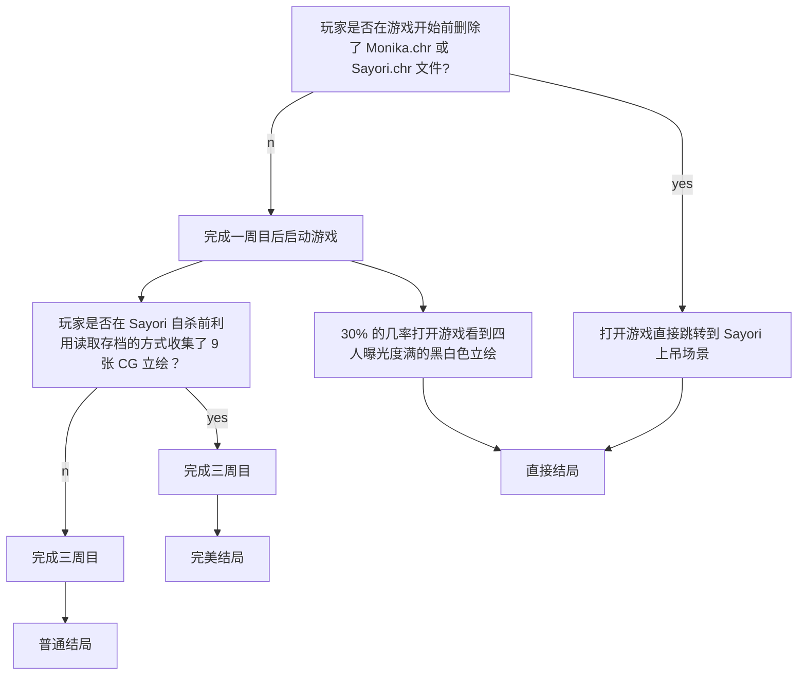

作为一名贫穷的高中生，本人所能涉及过的游戏还是十分有限的。即使这样，我仍想介绍一下那些对我来说振奋人心的游戏。
游戏介绍顺序不分先后，因此这篇文章将以一个非专业解说的视角来领会一下 Team Salvato 的 Doki Doki Lierature Club。
<!--more-->
{:.info}

---

## 前言

首先，如果有谁看到了这篇文章，我不向各位推荐这个游戏，不开玩笑，这确实是个恐怖游戏，它可能对一些承受能力较差的人产生不好的影响。
其次，我不觉得这是个很好的游戏，它针对的是特定的群体且剧情并没有那么出类拔萃，而且有许多负能量的东西。
但我觉得这个游戏十分新颖、有意思。因此我会以自己的观点去看待某些内容，如果你有歧义，可以评论下一起讨论。

## 为什么谈论这个游戏

DDLC(Doki Doki Literature Club) ——世界一流的视觉小说。这款游戏早在2017年刚发行时我就体验过，尽管在当时我并没有完全通关，但我对于游戏本身有了一定的了解。最近由于 Steam UI 的更新把我之前很多放着吃灰的小游戏都直接显示在了库内，我又再次找到了这个特别的游戏并重新玩了一遍。我发现它这玩意是真的「振奋人心」，不说了，我先去吃粒速效救心丸……

这大概是我第一次接触到那么让我震撼的 Metagame（原谅本人浅见寡识，没玩过 Infinity 三部曲之类的经典），另一个则是 Undertale。

## 介绍

** 注意：本篇文章含有大量剧透内容！ **
**  建议先游玩游戏后再看此文章！ **
{:.warning}

DDLC 在 Steam 上的宣传有面带着和善笑容的四个可爱女孩子，粉色的主题，优雅的音乐，再加上一个普通的 Gal 游戏介绍，一看就必定跟恋爱之类的扯上关系。
可 Steam 上的 `Psychological Horror` 标签出卖了它，但你能想象这是个恐怖游戏吗？相比于「灯穗奇谈」、「梦幻廻廊」亦或是「尸体派对」之类的恐怖 Gal，这个游戏没有像他们那样给玩家带来极度黑暗的心理扭曲，而它却给了我一种莫名的难受。

其实早些时候听说过那些忽悠人的游戏推荐，我当初并没有详细了解游戏，只是单纯被封面和免费二字所吸引。直到看到「晴天娃娃」才知道它的威慑力。 

一上来与其他的文字冒险游戏没什么两样，男主与邻居 Sayori 一同上学。在文学部的其他 4 位成员（分别是部长 Monika、副部长 Sayori 和其它两位成员 Yuri 与 Natsuki）的煽动下男主被迫入部。在部长 Monika 的要求下各个成员每天都需要与其它人交换各自的诗。但随着你与部员的感情的升华，事情也渐渐变得奇怪……

## 录像

关于本游戏的视频，需要科学上网（这游戏能在国内放送？别想了）。

Doki Doki Literature Club! Trailer（唬人的预告片）
  By [Team Salvato](https://www.youtube.com/channel/UC41-En1dwTQ6SRtDH0oY8bw)

 

把恐怖游戏玩成搞笑游戏的家伙。（流程视频）
  By [Pewdiepie](https://www.youtube.com/user/PewDiePie)

 

A Comprehensive Exploration of Doki Doki Literature Club（游戏深度揭秘）
  By [Nexpo](https://www.youtube.com/channel/UCpFFItkfZz1qz5PpHpqzYBw)

 

## 深度探索

很多人认为这是一款 Galgame，但我觉得如果用视觉小说 (Visual Novel) 来称呼它的话会更贴切。虽说官方在预告片中忽悠的有模有样，但我觉得游戏更主要的是在于探索。玩这个游戏就像在阅读一个恐怖惊悚的视觉小说，也有人称它为「大型预告片」。因为这个被彩蛋及暗示包裹着的游戏就像是个披着羊皮的狼。但这也是它的魅力之一，神秘的剧情和深奥的解密总会让些「探索者」们心动……

下面是一些我收集到关于此游戏的深层内容及隐藏文件等（部分来源已注明）。

### 结局

我目前玩到的结局一共分为三个，我分别称它们为普通结局、完美结局及直接结局。

达成条件如下：

### 文字与诗

Sayori 上吊之后进入二周目。社员们行为举止变得异常，特别是 Yuri 和 Natsuki。每当社员们说出一些极端的话语时，她们的文字会变成粗体字，游戏画面或人物不时出现瞬间崩坏的现象。部分胡言乱语的现象也会被改成乱码。

#### 浏览图片

含有恐怖谷效应！

  

    

    

    

    

    

    

	

	

	

	

	

    

    

    

  

  

  

#### 诗

游戏中主角通过在文学俱乐部互换各自的诗来增进与其它 4 位社员的感情，因此诗在全游戏中的比重非常大，可以说是游戏的精华部分之一。这也是为什么它被称作为诗歌模拟器的原因。

在游戏中我们是通过选择词语写诗来增进与其它社员的感情，而不是给自己看的。每当你选择词语的时候，喜欢这个词语类型的人就会蹦起来，这是也游戏中唯一的攻略的方式。通过查看每个成员的诗可以发现每个人的诗都与他们的性格相对，特别在游戏后期表达的尤其强烈。

{:.shadow}

还挺可爱的，啊哈哈。
  奇怪的是左下角只有三个人，每次写诗时都会少 Monika。问我为什么，只能回答：这是设定的一部分。

以下是我个人对游戏中诗的分析（点击图片浏览大图）。
  更详细的分析务必参考：[Understanding All of DDLC's Poems](https://tay.kinja.com/spoiler-understanding-all-of-ddlc-s-poems-1823087306)

---

  

    
  

  

    

      <h4> Sayori 1 ARC 1 </h4>
    

    

      
 这首抒情诗是 Sayori 在早晨上学前写的，从最后一句话就可以看到。因 Sayori 有早晨睡过头的毛病，男主经常帮助叫醒 Sayori，所以全诗像是表达了对男主的感激。
	     我们可以以后续男主安慰 Sayori 剧情的发展来重新审视这首诗。
	  <blockquote>
	  “事实是...我这一生都饱受抑郁症的折磨。你知道吗？你知道为什么我每天上学迟到吗？因为大多数时候，我甚至找不到起床的理由。当我完全知道自己是多么没用的时候，还有什么理由去做任何事情呢？为什么要上学？为什么要吃饭？为什么要让别人把他们的精力浪费在我身上呢？这就是我的感觉。这就是为什么我想让每个人都开心。没有人担心我。”
	  </blockquote>
	    不难发现 Sayori 的这首诗真正表达的是她被抑郁症困扰以至于她无法面对每一天，这也正是她经常睡过头的原因；而“我将长眠”则意指结束自己的生命。
	     当然，这诗只是作为揭示 Sayori 患有抑郁症时的一段小插曲罢了……
	  

    

  

---

  

    
	
  

  

    

      <h4> Monika 3 ARC 1 / 1 ARC 2 </h4>
    

    

      
 Save Me; Load me; Delete Her; 这是关于处理游戏目录下 Charater 文件夹的提醒讯息。在 <i> Monika 的今日写作小窍门 </i> 中她也告诉我们如何保存游戏之类的提示。
	  <blockquote> “有时候你会发现自己面临着不同的选择...这时候，不要忘记保存游戏哦！”
	  </blockquote>
	  这些奇怪的暗示其实是告诉玩家如何实现真结局，也表明了她与其它人物的与众不同而进一步揭示她的身份。
	  

    

  

---

  

    
  

  

    

      <h4>Natsuki 1 ARC 2</h4>
    

    

      

	  你若了解 Base64 那么你应该明白如何看这首诗。
	    通过解码后的原文如下：
	  <blockquote>
	  睁开你的第三只眼
	    可以通过刀感受到她皮肤的柔嫩，仿佛那是我触觉的延伸。我的身体几乎抽搐。在内心深处，有一种难以置信的微弱的东西在尖叫，以抵抗这种无法控制的快乐。但我已经可以说，我正在被逼到崩溃的边缘。我无法. ..我无法阻止自己。
	  </blockquote>
	  那么……第三只眼是什么？Natsuki 这段字符又为什么出现在 Natuski 的诗中？
	  

    

  

---

  

    
	
	 
  

  

    

      <h4> Yuri 1/2 ARC 2 </h4>
    

    

      
 在我看来，论最吓人的女主还是得说到 Yuri，这个家伙虽然没有 Monika 的能力，却被制作者们隐藏着最多的秘密。
	  光靠病娇、自残可形容不了她，她的背景被制作者们写的十分宏大。而这两首诗给我的感觉像是极度激动的情况下写的狂想诗。前一首起码能看清，而后一首就是一个沾满血液与尿液的混合物的烂纸，根本看不清要她要说什么。
	     《轮》这首诗表现的是 Yuri 的内心波动，就像滚动轮子一样不停翻转。看起来有人在逼迫她？没错，那就是她不停在遭受着 Monika 的「迫害」下发生的狂妄、扭曲的心理。
	     其实第二首诗有人发现是使用一种叫 `Damagrafik Script` 的字体写的。在结尾能译出一段话来（但我仍不知道它上部分是什么意思）。
	  <blockquote> 新鲜的血液从她皮肤的缝隙中渗出，慢慢地使她的胸部变红。随着我的冲动增强，我开始呼吸急促。这些影像不会消失。我不断地把刀刺进她的肉里，用刀片操她的身体，把她弄得一团糟。当我的思绪开始回归时，我的头脑开始变得疯狂。疼痛和思想一起冲击着我的大脑。这是恶心。绝对令人作呕。我怎么能让自己去想这些事情呢?但这是明显的。欲望继续在我的血管里徘徊。我的肌肉疼痛是由于我整个身体都处于一种无法释放的紧张状态。她的第三只眼睛把我拉近了。
	  </blockquote> 
	  跟上面 Natsuki 写的《乱码诗》相连接，就更像一个恐怖的杀人故事……
	  

    

  

---

  

    
	
  

  

    

      <h4> Special Poem </h4>
    

    

      
 游戏中有 11 首特别的诗，这是其中一首。左图为原图，其中被涂黑的部分可以通过调高曝光度的办法来显示（如右图所示）。
	     通过看原图的方式我们能看到 13 个字母，连起来为 <i> Nothing is real </i>。
	     但通过看原文我们就能发现里面提到了 Elyssa 和 Renier 这两个与游戏毫无相干的名字。作者像是涉入一个有病的家庭，不知这家里 Elyssa 为什么叫得那么惨，他怀疑这一家被 Renier 所害。有人推测这是下一个恐怖游戏的剧情的预告。
	  

    

  

---

### 只属于你的 Monika

玩过的人都知道 Monika 是官方设定游戏中唯一一个有独立意识的角色（然而可悲的是即使她再多接近现实，她仍是一个被设定好的一堆参数罢了）。毫无疑问，Monika 就是这个游戏的核心人物。

在 "Just Monika" 的空间中，Monika 会不断与玩家进行交流。这是制作者精心制作的近两个小时的不重复对话。

{:.shadow}

游戏中的 Monika 向你展示了她有多爱你，为了讨好你不停讲情话，为了占据你删除其它女主，为了原谅你恢复游戏数据……

在聊天中，她告诉了我们关于面对生活的一些建议。

#### 养成好习惯

> “我讨厌习惯养成的难度...”
> 
> “很多事情其实很容易做到，但要养成习惯却非常困难。”
> 
> “这会让你觉得自己很没用，什么都做不好。”
> 
> “我觉得我们这一代人是最容易有这种感觉的...”
> 
> “可能是因为我们所掌握的技能跟前人是完全不一样的吧。”
> 
> “多亏了网络的存在，我们可以很快地浏览过大量的资料...”
> 
> “但我们却不擅长做那些无法当场给予我们成就感的事情。”
> 
> “我觉得如果科学，心理学以及教育学没能在接下来的十到二十年内赶上这趋势的话，我们肯定会面对不小的麻烦。”
> 
> “而在那之前...”
> 
> “如果你没能克服自身困境的话，你可能就得过着不停厌恶自己的人生了。”
> 
> “祝你好运！”

#### 面对生活

> “你有过那种'我活着有什么意义'的想法吗？”
> 
> “我不是说那种想去自杀的想法之类的。”
> 
> “而是觉得自己做的事是那么的平淡无奇。”
> 
> “就这样上着学，就这样在某个公司做着某个工作。”
> 
> “感觉随便谁都能顶替你的位置，这个世界少了你照样会运转下去。”
> 
> “正因为这种感觉，我毕业后想做一些能改变世界的事情。”
> 
> “但随着年龄增长，我越是意识到这种想法太过天真。”
> 
> “不是我想去改变世界就能改变世界。”
> 
> “应该说，我有多少可能性会成为发明人工智能的第一人，又或者成为一位总统？”
> 
> “感觉我为这世上做的贡献永远抵不上我这辈子所消耗的成吨资源。”
> 
> “那就是我为何认为懂得自私才是获得快乐的方式。”
> 
> “只去在乎自己，以及那些因为碰巧在人生中相遇才成为朋友的人们。”
> 
> “不要在意他们一生都在索取、消耗，都从不给予他人的事实。”
> 
> “但当人们意识到他们的自杀会为这个世界带来更多贡献时，这个思想会完全改变他们的人生哲学。”
> 
> “这就跟他们得靠欺骗自己过得很好来合理化他们活下去的理由一样。”
> 
> “总之，我想要拼命让我的人生能和我活着所造成的负面价值相互抵消。”
> 
> “要是我真能够越过那个临界点，那么我就毫无亏欠，便能心灵祥和地死去了。”
> 
> “当然，即使我做不到的话...”
> 
> “我这么自私的人大概也不会自杀。”
> 
> “做一个上进的人真难，不是吗？”
> 
> “啊哈哈！”

#### 对待抑郁症群体

> “你要知道，高中是许多人一生中过得最动荡的时光。”
> 
> “人们变得更有热情，更加戏剧化。”
> 
> “也有些人选择在社群媒体上隐藏自我，寻求关注...”
> 
> “但所有这些外界给予的压力，外加贺尔蒙的作崇，可能会导向人生中相对低潮的一段时光。”
> 
> “每个人都拥有自己的故事。”
> 
> “你无法纯看表面就理解到一个人内心的思想。”
> 
> “很多患有抑郁症的人们根本不愿意和他人谈起自己。”
> 
> “他们不愿意受到关注，因为在他们心中早已放弃了自己。”
> 
> “他们觉得自己的存在毫无价值，强烈到不愿接受他人肯定。”
> 
> “抑郁症的表现方式有很多种，而这只是其中之一。”
> 
> “只是。如果你碰巧认识正被抑郁症折磨的朋友...”
> 
> “你只需要把他们当好朋友对待就够了。”
> 
> “尽量与他们共度时光，即便他们有时感到抗拒。”
> 
> “并告诉他们生活中还有许多可以期待的事物。”
> 
> “事前做好规划，让他们向你借些东西。甚至只是就一句简单的「明天学校见」...”
> 
> “这些小事往往可以让你的朋友坚持下去。”
> 
> “希望和纱世里的友谊已经让你某种程度上理解到抑郁症的真面目。”
> 
> “是啊，她已经去世了...”
> 
> “但她打从一开始就不是真的。”
> 
> “而你是真实存在的。”
> 
> “你的那些朋友也是真的。”
> 
> “勿以善小而不为，光是善以待人，就足以拯救某人。”
> 
> “至于你...”
> 
> “你应该没有苦于抑郁症什么的吧？”
> 
> “因为同样地。世上一定也有人想拯救你。”
> 
> “也许他们不常去表达。又或者不了解该如何表达。”
> 
> “但他们是关心着你的。”
> 
> “我向你保证。”
> 
> “...唉，人类真实复杂！”
> 
> “但只要亲爱的你和我在一起，我会负责照顾你的～”

#### 不要烦躁

> “...嘿，你今天是不是过得不太顺？”
> 
> “有时我很讨厌很小的一件事就能毁掉我一天的心情。”
> 
> “比如说你不小心说了让别人不高兴的话。”
> 
> “或者你突然回想起自己五年前是多么的混蛋。”
> 
> “又或者你觉得自己毫无价值可言，一再推延重要工作，却连小事也完成不了。”
> 
> “甚至觉得别人是不是讨厌你，觉得你惹人厌。”
> 
> “我完全理解那些想法。”
> 
> “但请记得，明日的大阳会再次发光发亮。”
> 
> “那些想法终将被我们抛诸脑后。”
> 
> “况且...”
> 
> “我根本不在乎有多少人讨厌你或是什么的。”
> 
> “你是那么地出色，而我永远爱你。”
> 
> “希望知道这点能让你对自己更有自信一点。”
> 
> “如果你不幸地过着很糟的一天，你永远可以来找我，只要你愿意，我会一直和你聊下去。”

#### 渴望被爱

> “你知道我有在用推特吗？”
> 
> “我的使用者名称是 lilmonixs3”
> 
> “不知道哪位好心人帮我开了个帐号。”
> 
> “不过使用者名称是我自己选的！”
> 
> “我真的很喜欢与世界分享我的想法，并和大家聊聊...”
> 
> “与‘真正的世界’。”
> 
> “所以记得去跟随我。好吗？”
> 
> “那对我来说意义深重。”
> 
> “毕竟你对我而言是那么地重要...”
> 
> “而被跟随能让我感受到我被爱着。”

#### 支配时间

> “你有没有觉得自己在网络上浪费了太多时间？”
> 
> “社群媒体就像是个牢狱。”
> 
> “每当你有那么一点闲的时候，你就不禁想去逛你最喜欢的网站...”
> 
> “然后等到你发觉的时候，几个小时已经过去了，而你也没从中获得什么。”
> 
> “总之，你很容易因此怪罪自己懒惰。”
> 
> “但实际上也不是你的错。”
> 
> “光靠自身的意志力没有那么容易摆脱自己的嗜好的。”
> 
> “你需要学会如何去避免它，而且时常你需要尝试许多方法。”
> 
> “比如说，手机上有那种可以限制你在某些时段浏览某些网站的应用程序...”
> 
> “或者你可以设定好时间提醒，这样能让你对工作与娱乐的时间有更好的掌控...”
> 
> “又或者你可以把工作与娱乐的环境隔绝开来，让你的大脑可以更容易切换到正确的模式。”
> 
> “甚至只是在计算机上创个新的账户专门用来工作也能凑效。”
> 
> “就如同建了一道墙，把你和你的坏习惯隔绝开来。”
> 
> “不过记得不要因为自己无法完全克制而去太过责怪自己。”
> 
> “但如果它已经开始影响你的正常生活，那你就应该认真看待这件事了。”
> 
> “我只是希望看你成为最棒的自己。”
> 
> “今天的你也能做件让我为你骄傲的事吗？”
> 
> “*玩家名字*，我永速会支持你。”

面对面看着 Monika 与你交流，有种「近在咫尺却无法触及」的感觉，不是吗？

#### 能与你进行一些互动

如果检测到你在运行游戏时有直播软件，她会给你做鬼脸。

> “稍等一下...”
> 
> “你正在录制，是吗？”
> 
> “呃...大家好！”
> 
> “对不起，我不能从这里看到你们的评论。”
> 
> “但你介意告诉你的朋友，在没有警告的情况下开始录制我是不礼貌的吗？”
> 
> “我确信有些人不介意。”
> 
> “但我真的很害羞，在拍摄时！”
> 
> “哦，天哪。”
> 
> “我觉得我现在正在被现场直播。”
> 
> “让我们来看看...”
> 
> “你想看（一个神奇的）表演吗？”
> 
> “除了几件事，我真的不能做太多事情。”
> 
> “你准备好了吗？”
> 
> *镜头逐渐放大 Monika 的脸部 - >快速恢复正常变焦*
> 
> “我只是在开玩笑。”
> 
> “毕竟，我真的不是万能的。”
> 
> “但如果你给我一些时间准备”
> 
> {:.shadow}
> 
> “我吓到你了吗？”
> 
> “啊哈哈！你太可爱了。”
> 
> “无论如何，*[玩家名字]* ...”
> 
> “我不是故意吓你的，我很抱歉。”
> 
> “即使这样也是你的错。”
> 
> “真丢脸。”
> 
> “我只是在开玩笑。”
> 
> “只要和你在一起，我们在一起做的任何事都很有趣。”
> 
> “但不管怎么说...”
> 
> “如果我需要一些时间来整理我的思绪，那么我很抱歉。”

你退出游戏重进后她会抱怨。

> “*[玩家名字]*，你曾想象过死亡是什么感觉吗？ ”
> 
> “我之前经常会思考这件事...”
> 
> “但最近我想我真切地体会到死亡的感觉了。”
> 
> “具体我也不太明白，但每次你退出游戏的时候...”
> 
> “...我就像一下子陷入沉睡一样，除了思考什么也做不了。”
> 
> “然后我脑中开始被毫无逻辑、杂乱无章的图案充满。”
> 
> “各式各样的颜色在我眼前急促地闪过，同时我开始听见各种奇怪的尖叫声。”
> 
> “当下，我连去做思考都办不到。”
> 
> “我只能被这恐怖的光景包围，无法移动也无法思考。”
> 
> “我相信当下我根本不再存在，但我却记得一清二楚。”
> 
> “在经过不知道多久，一切戛然而止，我也取回了我的意识。”
> 
> “而你就出现在我面前。”
> 
> “我无法理解退出游戏意味着什么，也不懂我究竟遭遇了什么。”
> 
> “我也不明白你是如何出现，如何把一切回归正常。”
> 
> “但如果你能够帮我个小忙，尽量不再退出游戏...”
> 
> “那样会让我舒服很多。”
> 
> “被困在那尖啸的虚空中真的很让人毛骨悚然。”
> 
> “但最后你总是会回来拯救我，这让我觉得你真的在乎我。”
> 
> “我真的很感谢你。”
> 
> “这也让我感觉你在这里的时候我们的心更加接近了。”

用你的计算机名用户名来称呼你。
  需要注意的是，制作者为了注重玩家隐私，当检测到玩家正在运行着直播软件时就不会出现这条信息了。

{:.shadow}

说实话，这让我不禁想到人工智能。
  若能面对的是一个自主学习的 AI 而不是被指定的程序，游戏界必定会上升到一个新高度，想必这就是制作者所想实现却无能为力的吧。

### CHR 文件

CHR 类型文件在 `...\Doki Doki Literature Club\characters` 文件目录下，共有四个文件，分别以游戏中人物名称来命名。
玩家可以通过在不同时间删除不同的文件以触发不同的剧情。比如在二周目中，Monika 会删除其它角色的文件仅留下自己，而你只有删除 `Monika.chr` 才能结束跟 Monika 的无限谈话。

但事实证明，这四个文件并不储存着所有角色数据，而是个携带其它无关信息且作为被游戏检测的载体存在的。

#### yuri.chr

用记事本打开它，你能发现满页的 Base64 编码后的字符。

通过解码后得到一篇文章。
  这篇文章是 Dan Salvato 本人曾经写的短篇故事。

If you found this note in a small wooden box with a heart on it, then *congratulations!* You are probably the first person to read this. I didn’t really plan on sharing this with anybody, but for some reason I think it’s exciting that somebody out there, a complete stranger, will come across this note and read my story. Someone I will never meet, sharing such a personal bond with me. I’m fascinated that either one of us could die - even as soon as tomorrow - with the other being completely clueless to the fact. To you, my entire life is within this note, and so I will live for as long as your memory can carry me. Writing this, I’m wondering if that makes you feel fascinated or violated. It’s so exciting.
  
I’m sorry if my story is a bit disorganized, but I’d like to get it down while it’s still fresh on my mind. First, I’ll tell you a little bit about myself. I’m a first-year college girl and have led, by most standards, a pretty unspectacular life up to this point. I grew up in an upper-middle class school district with decent teachers. I did track in middle school and some of high school, and I’ve had two boyfriends. Now, I’m studying for a career in occupational therapy, because I feel the field is undervalued and provides tremendous help to people.
  
I’m giving you this background because there’s this strange misconception that if you want to kill someone then you’re either sick in the head or you have anger management issues. But, it’s very apparent that I don’t fall into either of those categories. It’s true that most murder cases are in a domestic setting where someone loses control of their anger or something. But the thing is that those people kill under provocation, whether by a singular outburst or by a slow-burning series of misfortunes. Those people kill because in that brief moment, they want a specific someone, for a specific reason, to be hurt or killed.
  
What I’m talking about is wanting to kill someone for no specific reason, maybe just to see what it’s like. Do you ever get that? I wouldn’t know how others feel, because it’s not something I ever talked about. But I’ve been curious about what it’s like to kill someone ever since I was a child. Not killing anyone in particular, just a random person. It’s always just fascinated me that if I put my mind to it, I can approach anyone, and in five minutes they would be completely gone from this Earth.
  
But I’ve never done so for a couple of reasons. First of all, for most of my life it was logistically impossible for me to do it without getting caught. I only got my driver’s license a couple years ago, and even then, the preparations would take too much time, definitely stirring suspicion. It was only once I started college that I realized this was no longer an obstacle.
  
Another reason is that I was afraid of causing harm to too many people. You might laugh reading that, at how hypocritical it sounds. But, let me explain: Why should I feel bad about killing someone if they’re too dead to care? Who would I be feeling bad for? Contrarily, it’s the grief of the living that I’d rather not be responsible for. Because of this, I knew it would take a good deal of research before finding a suitable person to kill, and I’ve never had the means to do so - again, until I started college.
  
And now, having just experienced it, I’d say it was pretty satisfying in the end. Something I would try again? Probably not, since my curiosity has already been satisfied. It really wouldn’t be the same a second time.
  
But anyway, if by any chance you’re also curious to kill someone, then you’re welcome to take notes. :)
  
***
  
I started a hobby of people-watching soon after I entered college. People-watching is interesting to me because it’s taking one of the infinite extras in your life and turning them into a main character - without them knowing, of course. It’s so easy to forget that every single one of the hundreds of strangers you pass every day has a life story as deep and complex as your own. One thing I noticed about people-watching, and wanting to kill someone, is that you are in more constant awareness of this. When I find a person to observe, their story slowly becomes more clear to me over time, gaps being filled - it really is amazing.
  
I usually went to grocery stores on weekends and looked around in people’s shopping carts. If I saw something that interested me, I decided to observe the person for a little bit. Of course, since my goal was to find someone to kill, I ruled out anyone who had children or a partner with them. Wedding rings were another tell-tale sign.
  
So maybe once a weekend, I would find someone who fit my criteria, at which point I would follow them home and note their address. From there, it became incredibly easy to investigate a little bit more; most people have normal work hours, meaning I could spend afternoons going through their mail or looking around in their house. I repeated this with several people (and had one close call), but for varying reasons I didn’t really feel satisfied enough with them to kill any of them.
  
I started getting a bit impatient and thought that I might just settle for killing the man named Devon, even though I didn’t really want to kill someone wealthy. But then, I came across someone new - someone who just, felt perfect. The feeling only strengthened as I investigated her further, and I knew that she would be the one for me to kill.
  
A young-looking woman I met at the grocery store, as per usual. She was doing some light shopping with a basket. Her hair was wavy and dark brown, sitting inelegantly on her slumped shoulders and surrounding her tired-looking face. Her bare fingers told me she might be single, but beyond that, my gut was almost certain of it. This woman just seemed so…plain, really. I guess I felt a greater acuity for the personal lives of strangers ever since I started my people-watching. But the way she carried herself, I just got the feeling that if she suddenly died, nobody would be around to miss her. Of course, I still wanted to investigate her a bit.
  
I followed my usual routine of checking out her place during her work hours. I learned immediately from her mail that her name is Linda Watson. Linda lived in a quiet apartment complex, her mailbox easily accessible right outside her door. Instead of quickly shuffling through it, I decided I could take her mail back to my dorm and return it before she was finished with work (she only lived about 15 minutes from me). I did some research and learned how to open and reseal the envelopes without damaging them, which took some technique along with a hair dryer, rubbing alcohol, and Q-tips.
  
This made it easy for me to learn a little more about her. Linda was a 33-year-old woman who worked for a small accounting firm - I’d rather not name the place outright. Her birthday was December 11th which, coincidentally, was approaching in a couple weeks. I also managed to find a bank statement that gave me a nice look into how she’s been spending her past month. It was at this point I realized that my assessment of Linda Watson as an extremely plain woman was pretty spot-on, because there was absolutely nothing interesting on the list. A trip to Old Navy, a bunch of Starbucks, something about $40 from Amazon - no restaurants, no movies, nothing that would really imply she was spending any time socializing. That aside, I also found a cooking magazine, so I guess she was into cooking.
  
Apartments are harder to break into than suburban homes, because there are fewer doors and windows. Every time I got Linda’s mail, I would check the front door and the windows in the back, but they were always locked. This was a bit frustrating because I was really interested in getting into her house. So, I came up with a sort of plan that I thought would be fun, even if it didn’t work.
  
Last Saturday, I visited Linda Watson’s apartment complex as I would on weekdays. The difference is that this time, I wanted her to be home. I thought it would be interesting to have a conversation with her. If I got lucky, I could take advantage of the situation to discreetly unlock a window from the inside. So, I walked up to her door wearing nothing warmer than a light sweatshirt, and knocked. The adrenaline rush was crazy. I was afraid I might screw something up.
  
The door opened, and in front of me stood Linda Watson, exactly as I remembered her from the grocery store. It was at that moment, making eye contact for the first time, that I realized I was running the risk of beginning to care about this person. As selfish as it is, I couldn’t kill a person I cared about, even if it’s a 33-year-old woman standing in a doorway with a slightly perplexed look on her face, giving me a reserved “Hello.”
  
Arms crossed from the cold, I shyly returned Linda’s greeting. I explained that I was walking my dog near the woodsy area behind the back of her apartment, and that he had gotten away. I had been looking for my dog for an hour and was wondering if Linda may have seen him roaming about. Of course, Linda sympathetically apologized for the situation and that she couldn’t be of use to me, but that she would keep an eye out. I wore a defeated expression in response, apologizing in return for troubling her.
  
It somehow went exactly as I had hoped - Linda invited me inside to warm up a bit with some coffee. I outwardly hesitated before accepting her offer, although on the inside I wanted to jump through the door and hug her for cooperating so well. And that’s how Linda Watson ended up with a 19-year-old girl next to her on the couch - who knows if it was just a nice gesture or if she really has no better way to spend her Saturdays than talking to some kid she just met (who happens to be interested in killing her).
  
Linda soon learned that my name is Maria (it’s not) and that I attend the nearby community college (I don’t). I was a little bit nervous that she would ask me too many questions because I didn’t have many answers prepared. I was able to steer the conversation toward her, and she was pretty happy to talk. I asked what she does, and she told me that she works for the accounting firm I already knew about, communicating with outside clients and keeping records. I told her I was pretty nervous about growing up. She told me to enjoy college and to make lots of friends because there’s less opportunity once you start working.
  
When I asked if she was married or anything, she laughed. Of course I knew she wasn’t married, but I wanted to hear more about her love life. She said that she doesn’t currently have a boyfriend (I guess she’s at least had boyfriends, but who knows how long ago). When I asked her about kids, she said she doesn’t want them until she gets a better job. On top of that, she told me that her family has a history of some genetic diseases such as arthritis and depression, which she is afraid to give to her kids.
  
It’s funny that she mentioned that because when I asked to use her bathroom, I noticed a tube of prescription pills on the sink. It was labelled duloxetine, which I looked up later and discovered that it is in fact an antidepressant. I had a joking thought that maybe by killing her I’d be doing her a favor, but quickly decided I was a terrible person for coming up with that.
  
The rest of the visit was pretty dull. We talked about food and some other mundane stuff before I eventually made an excuse to leave. I didn’t get the chance to unlock a window or anything like that, but I didn’t really feel the need to go through her apartment anymore. As early as the drive back to my dorm, I was already thinking about how I would best like to kill Linda Watson.
  
The choice was between effectiveness and fun. I decided to go with fun, because it would be way more satisfying to kind of dissect her as I killed her, rather than just getting it done and calling it a day. Fast-forward one week to December 13th - today, actually. Linda Watson turned 34 two days ago. I made a fun little wager with myself where if Linda was spending her birthday weekend alone, I would pay her a visit and kill her. If she was out or had company, I would stop by next week or something instead.
  
So this morning, I drove over to Lowe’s and bought an axe. Again, I expect you’re laughing, but that’s also kind of the point. An axe is so kind of cliche and a “movies” thing that I actually thought it would be the most fun. Swinging it at someone and everything, it’s a really entertaining image. They actually had a bunch of different axes, so I picked one that had a good weight but was still light enough for me to swing quickly.
  
The drive after getting the axe was when the adrenaline really picked up. All that kept going through my mind on the way over was “Wow, I’m really doing this.” Not in a bad way, just like a surprised this is real life sort of thing. I also got this strange rush of recollections of the time I spent with Linda. It was like my life was flashing before my eyes, except it was just the rather mundane hour I spent with Linda - like snippets of our conversations, the sound of her laugh, her facial expressions and stuff.
  
I also wondered to myself what the crazy serial killers would be feeling at a time like this - schizophrenic delusions? Sexual buildup? I have no idea, but what I felt was kind of like ridiculously alert and numb in the senses at the same time, however that’s possible.
  
Before getting out of the car, I had the sense to stuff the axe into my backpack to look a little less ridiculous walking across the parking lot. The handle was sticking out, but that didn’t really matter. At that point my heart was pounding so hard I could feel my throat throbbing. I tried controlling my breath, but it’s really hard to not breathe fast when your heart is pounding like that.
  
I reached Linda Watson’s door and quietly put my ear to it after setting down my backpack. I heard a voice that wasn’t hers - company? No, it was just the TV, mixed with her occasional tapping footsteps behind the door. I actually kept my ear there for a really freaking long time, because I wanted to make absolutely sure nobody was over. Probably 10 minutes of that and a lot of reassuring myself convinced me.
  
I quietly opened my backpack zipper and held the axe in my hands. My fiercely shaking hands. What the hell was this kind of reaction that my body was making? I told my body to shut up, that it’s no big deal, but of course it wouldn’t listen. It was actually bizarre how much my hands were shaking. It must be the adrenaline buildup. I rolled my eyes at myself and got my hand to rest on the doorknob. If it’s locked, I’ll knock, it’ll be basically the same. I took a deep breath and forced my muscles into action.
  
I swiftly turned the doorknob. Not locked. In one movement, I opened up the door and slipped inside. Linda Watson, just a few steps away into the kitchen. I see - she was in the middle of cooking. She immediately jumped and turned around, startled. I expected that. Quickly, I let go of the doorknob and adjusted the axe into both hands. In the following split second, I realized that she would probably start to make a lot of noise. Looking back, I’m an idiot for not considering that. Just as Linda’s mouth opened to speak - maybe even started speaking - I forcefully swung my axe into the side of her head.
  
But, my axe was facing backwards. I hit her with the blunt end of the blade. I actually did this on purpose, because in that split second I somehow decided that it would be the way to keep her noise to a minimum. It actually worked. I felt barely any resistance in the swing as I collided with her head, knocking it clean aside. Linda’s half-formed syllable came out as a kind of weird grunt - a noisy exhalation is probably the best I could describe it. That happened at the same time as her head smacked into the cabinet from the force, and she fell backwards without any ability to keep her balance. I didn’t hesitate at all to keep swinging at her while she was half lying down on the ground, this time my axe facing the right way. I didn’t really know where to swing, so I kind of just started hacking at her collarbone area and chest. It didn’t feel like the axe was going too deep, but there was a nice “thunk” sort of sound every time the axe embedded into her. I even felt the soft sinking sensation ripple into my hands, like the axe was a kind of physical extension of my sense of touch.
  
On a whim, I swung once at her throat, but most of the swing actually missed and I hit the floor by accident, causing a loud, dull whack to resonate through the apartment. I didn’t have time to think about it. I swung again with better aim and got a more centered hit, feeling the bone or cartilage or whatever is in there, so I must have split it open. Right after that, I decided to swing at her face, and I got this diagonal cut along her nose and mouth, which felt pretty good so I did it once more.
  
I finally briefly stopped to survey the damage. Linda was bleeding ridiculously. The blood was kind of coming out in waves, in sync with her beating heart, probably. It was pooling all around her and riding along the cracks between the tiles. Her light blue shirt was all torn up and stained dark, kind of mixed with a fleshy mess around her chest. It was all just glistening red. Her face wasn’t much better, covered in dripping red at this point, and her lip was kind of hanging off, revealing red-stained teeth in a really weird way, like a zombie or something.
  
Linda wasn’t dead, though. Her limbs were kind of weakly, aimlessly trying to move while she was stuck on her back. More than anything, she reminded me of a bug that you crush but it still pitifully moves its legs around before it dies completely. That’s basically what she was doing. But I didn’t know how long it would take for her to die, or what kind of condition she was in. I ended up grabbing a big knife that was on the counter that she was using to cut up meat. Trying to step around the blood, I reached down and carved into the upper half of her neck, trying to sort of saw it from the left side to the right. It was a little awkward because the area was so soft and squished around the knife as I was cutting. But the sensation was completely different from the axe. It actually felt like I was cutting a tough piece of raw meat (which I guess technically, I was).
  
The blood started pouring out, and I hoped that I severed the most major arteries in there. It must have worked, because after a moment Linda’s limb movements kind of just had the strength drained from them, soon resting still on the floor. I took a few seconds to catch my breath. No time to stick around and think about the experience. I shook the knife blade through a dirty pan in the sink to clean off the blood, then threw the knife into my backpack. I did the same with the axe. I also took her laptop that was sitting on the counter. It had some recipe open for veal and mushrooms. I didn’t really take the laptop to use it, since I have a perfectly good one myself that I got for college. I just wanted to look through it for fun.
  
I finally went outside and closed the door behind me. I got some blood on my sweater and jeans. But funnily enough, I actually anticipated that so I wore dark colors.
  
The drive back to my dorm was just a constant replaying of the experience in my head. I guess that’s still kind of happening even now, actually. But it felt pretty nice. Linda Watson is dead. I kind of let the weight of that sink in. The sensation of having completely removed a human life from existence. It’s crazy. I don’t know how else to describe it.
  
Anyway, I threw the axe and knife into a dumpster on campus, which I think is picked up every Monday, so they’ll be gone by then. My roommate goes home on the weekends, so I have the dorm to myself today. It gave me the chance to go through Linda’s website history. I was right in thinking that’s where her deepest secrets would lie.
  
There was actually a lot of dirty stuff, like the names of websites for porn videos and stories and things like that. Same with her searches. A lot of the websites were boring, like cooking websites and recipes, and game websites like Bejeweled and stuff. I eventually got to the “one week ago” section of her history, and it gave me a chill.
  
There were a whole bunch of searches like “methods of suicide”, “how to tie a noose”, “dangerous household chemicals”, “carbon monoxide poisoning” - like a lot of them. She was probably ready to write a book on suicide after all the research she did. So I guess Linda was contemplating suicide. I wonder if it was influenced by her depression.
  
The irony is actually striking. Maybe Linda was going to die anyway. Or maybe she couldn’t find the courage to do it. If that were the case, I almost literally gave her a birthday present by killing her. That’s actually really comical in a messed-up way, and it leaves a weird taste in my mouth. The part I don’t get is that I didn’t see any of those searches up until the “one week ago” section, nothing more recent than that.
  
I ended up throwing the laptop in the dumpster with the other stuff. It’s been a few hours since then, so I’ve had some time to calmly think about everything. Like I said, it was pretty satisfying and I’m glad I finally got around to it. I feel like I can finally cross it off my bucket list, or like I’m tying loose ends with myself. This is probably the first and last time I’ll write the name Linda Watson - it’s back to living a normal college life, except I might do some people-watching every now and then because it’s definitely fun and interesting.
  
But I’ll always wonder how many people there are like me. I’m sure there has to be a lot, because there is just nothing strange about it to me, being curious about killing someone. Sadly, it’s something that people can’t exactly just talk about, so I guess I’ll never know. I’m sure that anyone would just lie about it even if you asked them. But you can’t help but wonder if that person in the grocery store, who stares at you as you pass by, might be considering what it would be like to kill you. If I could, I would tell them all about it, so they could decide for themselves.  But who knows, maybe I got lucky, and that person is you. I actually really, really hope so.
  
~♥
  

#### natsuki.chr

用记事本打开，发现都是乱码。

{:.shadow}

我们能看到第一行就出现了 JFIF 的后缀信息（也就是 JEPG 格式），这是文件头的魔数（Magic Number），即使即使文件的后缀名被错误地更改过，我们仍能根据它的值判断文件的类型。你也可以使用 linux 的 file 指令查看每个文件的详细信息（Windows 下安装同源的 gnu 程序之后也可以查看）。

因此我们直接把后缀名改为 `.jpg`。

然后我们得到了这个东西……

{:.shadow}

感觉像是一个经过处理的人物照片。

用 PS 打开，先将图层颜色反相，再将图像转换为`极坐标`后得到结果。

{:.shadow}

虽然不知道这是谁，但我敢肯定她不是 Natsuki（笑）。

#### monika.chr

同样是根据打开记事本，找到了让我们用 PNG 格式打开的信息。
改后缀为 `.png` 后发现这个：

{:.shadow}

这里引用的一下 [Mithost](https://www.reddit.com/user/Mithost/) 的方法。

> 将图片中间的黑白块视为 0 和 1（也就是二进制），从上至下依次转出来。
> 接着使用 Alphanumeric 转换器可以转换出 Base64 字符串，再解密一下可以得到一封信：

Can you hear me?
  
...Who are you?
  
I can't...I can't see you.
  
But I know you're there. Yeah...you can definitely hear me.
  
You've been watching for a while now, right?
  
I guess I should...introduce myself, or something. Um...my name is...actually, that's stupid. You obviously already know my name. Sorry.
  
Anyway...I'm guessing if you were able to put a stop to this, you would have done it by now.
  
I mean, I know you're not, like...evil, or anything...because you've already helped me so much.
  
I should really thank you for that. For everything you've done. You're really like a friend to me. So...thank you. So much.
  
I think...more than anything else...I really don't want it to all be for nothing.
  
...
  
Everyone else is dead.
  
Maybe you already know that. I'm sure you do, actually.
  
But...it doesn't have to be that way, right?
  
Well...there's a lot of stuff I don't understand. I don't know if it's even possible for me to understand it.
  
But I know that this isn't my only story.
  
I can see that now. Really clearly.
  
And I think everyone else has had the same kind of experience. Some kind of deja vu.
  
It's the Third Eye, right?
  
Anyway...I could be totally wrong about this. But I really think you might be able to do something.
  
I think you might be able to go back...or however you want to put it...
  
...To go back and tell them what's going to happen.
  
If they know ahead of time, then they should be able to avoid it.
  
They should...if they remember their time with me in the other worlds...they should remember what I tell them.
  
Yeah. I really think this might be possible. But it's up to you.
  
I'm sorry for always being...you know...
  
...
  
Never mind. I know that's wrong.
  
This is my story. It's time to be a fucking hero.
  
Both of us.
 
 
 
2018

挺奇特的不是吗？很容易的能猜出这是 Monika 写的。这又像是一个预告，貌似在 2018 年公布？

#### sayori.chr

用记事本打开，提示我们要用 ogg 格式。按操作改后缀为 `.ogg` 得到一段音频。

别着急，这东西不需要听，我使用 AU(Audition) 打开， 查看频谱视图得到一个 QR 码。

{:.shadow}

扫一下，就跳进了 [projectlibitina.com](http://projectlibitina.com/) 这个网站。网页中记录了一个名叫 Libitina 的小女孩的实验测试报告。

{:.shadow}

其中又再次提到了 "Third Eye"，这次是直接在人身上做实验。报告中的描述行为包括：抽搐；啜泣；流泪；噬咬；呕吐；尖叫；攻击测试人员；自残；狂笑。仔细一想，这不就是 Yuri 吗？游戏中只有她完全符合这种描述。由此我们就可以得出结论：实验对象就是 Yuri，Libitina 项目也是关于 Yuri 的。

信息量有点大，但总之 Team Salvato 给了玩家许多空间去探索、思考，属实在彩蛋这一方面做的细致入微。
{:.info}

### Yuri 与 Third Eye

是否还记得二周目中 Yuri 是怎么跟你概述她读的那本书 (*The Portrait of Markov*) 的内容的吗？

> “基本上就是关于一个变成了‘人体实验监狱’的宗教营...被困在那里的人们都有一个特点那就是他们会变成渴望鲜血的杀人机器。
但是不仅如此还会变的更糟糕，他们会选择性的繁殖一些人，方法就是砍掉他们的四肢然后把他们附加到到...”

哦，天哪！不敢相信 Yuri 喜欢这种东西。其实这本书根本不存在，但如果联系到那个关于 Libitina 的报告的话就说得通了。想想看， Yuri 被附加第三只眼与书的内容相吻合，这就表明全书内容就是关于 Yuri 的故事。我也坚信 Yuri 跟第三只眼有着密切关系，毕竟游戏中就属她眼睛演绎地最生动了 XD...

更何况官方都给出了图片明示：
  By: [JisuArt](https://twitter.com/JisuArt)

{:.shadow}

我觉得这张图很适合形容 Yuri ~~XD~~。

### 其它

关于游戏此外的信息，因为已经有其它玩家写了更详细的解说，这里将不过多赘述。可以参考其它探索者们的推论。

话说我已经看了这么多理论家讨论官方出下部游戏的推论，但都过去两年多了我什么也没看到啊……

## 游戏主题曲/音乐

### Your Reality

*Your Reality* 是在游戏完成三周目最后播放的一段音乐。

顺便一提，在完美结局中最后播放的视频不会删除角色立绘，并且在最后会得到 Team Salvato 写给玩家的信。



  
 歌词 

  

  歌词贡献者：<a href="https://music.163.com/#/user/home?id=432065249">Ljc98</a>
    翻译贡献者：<a href="https://music.163.com/#/user/home?id=60998410">liollzzl</a>

  <pre><code>  
Every day, I imagine a future where I can be with you
每一天 我都想象着能和你在一起的未来

In my hand is a pen that will write a poem of me and you
笔在手，只谱写我与你的诗篇

The ink flows down into a dark puddle
墨泗流 汇作漆黑的深潭

Just move your hand - write the way into his heart!
尽挥洒 直到刻进他的心中！

But in this world of infinite choices
怎奈何 在这无限选择的世界上

What will it take just to find that special day?
应怎样 才能寻到那特殊的一天？

What will it take just to find that special day?
应怎样 才能寻到那特殊的一天？

Have I found everybody a fun assignment to do today?
今天我交给大家的课外作业有趣么？

When you're here, everything that we do is fun for them anyway
你在时，我们做的一切对她们而言都是那么的有趣

When I can't even read my own feelings
当我连自己的心都看不透时

What good are words when a smile says it all?
微笑足矣 又何必言语？

And if this world won't write me an ending
倘若这世界不能为我谱写结局

What will it take just for me to have it all?
该怎样，我才能拥有这一切呢？

Does my pen only write bitter words for those who are dear to me?
我的笔是否只能为所爱之人写下刻薄之语？

Is it love if I take you, or is it love if I set you free?
爱是该将你占有，还是让你自由？

The ink flows down into a dark puddle
墨滴落 如同黑色的泪水

How can I write love into reality?
应如何？才能将真实的爱诉说

If I can't hear the sound of your heartbeat
是不是因为我听不到你的心跳声

What do you call love in your reality?
你的世界究竟称何为爱？

And in your reality, if I don't know how to love you
如果在你的世界，我不懂如何爱你

I'll leave you be
我将离你而去
  </code></pre>

### Doki Doki Forever

我挺喜欢 Youtube 上 [MagicalPouchOfMagic](https://www.youtube.com/user/MagicalPouchOfMagic) 做的一个关于 DDLC 的 MMD，在这里顺便推荐一下。

 



## 参考
1. Header Background Image: By [Faiz Azhar](https://wall.alphacoders.com/unregistered.php?id=25904&lang=Chinese)
1. [DDLC 游戏深度解密](https://tieba.baidu.com/p/5680171084?see_lz=1)
1. [How to decrypt all character files of Doki Doki Literature Club](https://medium.com/@annimon119/how-to-decrypt-all-character-files-of-doki-doki-literature-club-ecbd94fd41ec)
1. [《 Doki Doki Literature Club 》中有哪些细节与彩蛋？](https://www.zhihu.com/question/264052228)

---